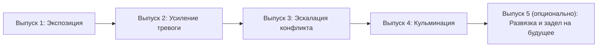

## Сюжетный каркас (сериальная структура)

Следующий шаблон является практическим применением описанных выше принципов. Он превращает «взгляд изнутри» в динамичную нарративную дугу, которая сохраняет ощущение неопределённости и позволяет последовательно проходить через разные исторические эпохи.

Используем универсальный сюжетный каркас на 4–5 выпусков, который можно повторять десятки раз, проходя через эпохи без ощущения «перезастройки».

### СЕРИАЛЬНЫЙ СЮЖЕТНЫЙ КАРКАС (4–5 выпусков)

#### Примерная схема повествования:

##### Выпуск 1: Экспозиция и первая трещина
- **Задача:** Обозначить эпоху, фон, намекнуть на первую неустойчивость.
- **Практика:** Обыденная жизнь, первые тревожные новости или странности, намёки на напряжение.

##### Выпуск 2: Усиление тревоги
- **Задача:** Показать развитие и первые последствия нарушений привычного хода.
- **Практика:** Реакция общества, рост слухов, первые реальные перемены или проблемы в городе.

##### Выпуск 3: Эскалация конфликта
- **Задача:** Довести ситуацию до порога кризиса или общегородской тревоги.
- **Практика:** Много слухов, паника, явные экономические/общественные сбои, обострение бытовых и политических противоречий.

##### Выпуск 4: Кульминация
- **Задача:** Отразить главное событие — кризис, катастрофу, переворот, стихийное бедствие.
- **Практика:** Максимальная плотность новостей, срочные сообщения, массовые последствия.

##### (Необязательно) Выпуск 5: Развязка и открытие новой арки
- **Задача:** Показать реакцию, первые итоги и зарождение новой интриги.
- **Практика:** Итоги, попытки восстановления, первые признаки новых проблем или тенденций.

#### Блок-схема

