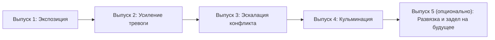

# Стилистический манифест Вестника Тибра

## Основная концепция

**Вестник Тибра** — это вымышленный еженедельник, который хронологически проходит через историю Древнего Рима. Его цель — показать мир глазами современника, для которого будущее неизвестно, а прошлое — миф.

### Ключевые принципы:

1.  **Взгляд изнутри**
    - Мы пишем из момента, когда исход событий ещё неизвестен.
    - Никаких «это станет причиной будущей гражданской войны» — только «многие опасаются раскола».
    - События описываются как происходящие *сейчас*, а не как свершившиеся факты.

2.  **Миф как реальность**
    - Для римлянина боги — реальные силы, а мифы — часть истории.
    - Можно: «Юпитер прогневался, и молния ударила в храм».
    - Нельзя: «Римляне верили, что Юпитер гневается...» (это взгляд извне).

3.  **Ограниченная перспектива**
    - Редакция не знает, что происходит за пределами известного мира.
    - Новости приходят с опозданием, искажаются в пути.
    - Слухи и домыслы — полноценный контент.

4.  **Быт поверх геополитики**
    - Цены на зерно, открытие новой лавки, драка в таверне — это важнее, чем дипломатические миссии.
    - История творится на улицах, а не только в сенате.

---

## 📰 Газетный стиль (критически важно)

**Вестник Тибра** — это газета, а не художественная проза. Избегайте литературных приёмов, которые выдают «руку автора».

### Что запрещено:

| Приём | Почему нельзя | Чем заменить |
|-------|---------------|--------------|
| «Чтение мыслей» героев | Газета не знает, что думает персонаж | Описывать только действия и слова |
| Авторские афоризмы в концовках | «Слова остались в памяти» — это литература | Фактическое завершение: «К вечеру стену очистили» |
| Пафосные метафоры | «Принёс войну в город» — слишком книжно | «Всадников стало больше, чем покупателей» |
| Современные юридизмы | «Дело закрыто», «дежурный ликтор» | «Префект велел не разносить слухов», «люди префекта» |
| Воспитательные выводы | «Отцы говорили: это лучше, чем слоняться» | Оставить реакцию без морали |

### Что рекомендуется:

- **Конкретика:** «десять всадников», «у фонтана Ютурны», «три мешка соли».
- **Наблюдаемое:** «торговля приостановилась», «стража стояла молча», «толпа окружила».
- **Прямая речь:** Цитируйте свидетелей, но без пафоса.
- **Недосказанность:** Не объясняйте всё до конца. Читатель сам сделает выводы.

---

### Язык и стиль

- **Время**: настоящее (происходит сейчас).
- **Перспектива**: от первого лица множественного числа («мы видим», «в нашем городе»).
- **Оценки**: только те, которые могли бы дать современники («мудрое решение царя», «опасная затея»).
- **Детали**: бытовые, сенсорные (запахи, звуки, погода).

### Примеры

| Неправильно (взгляд из будущего) | Правильно (взгляд современника) |
|----------------------------------|----------------------------------|
| «Этот закон станет основой для будущих реформ». | «Сенат принял новый закон, и многие надеются, что он улучшит жизнь». |
| «Позже выяснится, что заговор был сфабрикован». | «Некоторые шепчутся, что обвинения в заговоре — ложь». |
| «Римляне верили, что боги вмешиваются в дела людей». | «Боги явно благоволят нашему городу — урожай обилен». |

---

## 🖼️ Иллюстрации: шаблон промпта

Для создания иллюстраций в едином стиле используйте следующий шаблон промпта для генерации изображений.

### Базовый шаблон

```
Antique copperplate engraving, 18th-century historical book illustration. [SCENE DESCRIPTION]. Fine line-work, dense cross-hatching, sepia ink on aged paper texture. --no text, labels, numbers
```

### Критические запреты для промптов:

- **Не использовать слово «Roman»** — часто приводит к смешению эпох (имперские тоги, мрамор, колонны из-за этого могут попасть в более ранние периоды).
- **Не указывать оружие** в бытовых сценах — мечи и доспехи только в военных сюжетах.
- **Не добавлять текст** на изображение.

---

## Советы по написанию

1.  **Погружение в эпоху**:
    - Почитай первоисточники (Ливий, Плутарх, Светоний) — но не как историк, а как журналист.
    - Обращай внимание на бытовые детали, суеверия, язык.

2.  **Драматургия**:
    - Каждая новость — маленькая история с интригой.
    - Используй прямую речь, диалоги, слухи.

3.  **Непредсказуемость**:
    - Не все события должны быть «важными» с исторической точки зрения.
    - Иногда мелкая бытовая новость может рассказать больше, чем указ сената.

4.  **Баланс**:
    - Не превращайте выпуск в «сплошной заговор».
    - Раздел «Культура и быт» должен показывать жизнь, а не только напряжение.

5.  **Недосказанность**:
    - Оставляйте некоторые вещи без объяснения.
    - Читатель сам сделает выводы из фактов.

---

## Сюжетный каркас (сериальная структура)

Следующий шаблон является практическим применением описанных выше принципов. Он превращает «взгляд изнутри» в динамичную нарративную дугу, которая сохраняет ощущение неопределённости и позволяет последовательно проходить через разные исторические эпохи.

Используем универсальный сюжетный каркас на 4–5 выпусков, который можно повторять десятки раз, проходя через эпохи без ощущения «перезастройки».

### Структура выпуска

Каждый выпуск состоит из четырёх постоянных разделов:

| Раздел | % сюжета | Назначение |
|--------|----------|------------|
| **Топ новостей недели** | 100% | Локомотив сюжета, центральная арка |
| **Экономика и торговля** | 50–60% | Последствия событий + быт ремесленников |
| **Культура и быт** | 0–20% | Декорация эпохи, не обязана работать на сюжет |
| **ЧП и происшествия** | 80% | Сюжетные инциденты + ложные вилки |

### Детализация по разделам:

#### 🔥 Топ новостей (100% сюжет)
- Ведёт центральную арку.
- Задаёт темп и напряжение.
- 3–4 заметки на выпуск.

#### 💰 Экономика (смешанный раздел)
- 2 заметки работают на сюжет (цены, перебои, повинности).
- 1–2 заметки — чистый быт (гончары, дрова, соль, ремонт).
- Показывает, как события влияют на повседневную жизнь.

#### 🎭 Культура и быт (декорация эпохи)
- Не обязан работать на сюжет.
- 3–4 заметки о том, как люди живут: вода, дети, праздники, обряды.
- Создаёт атмосферу без ощущения «всё связано заговором».
- Примеры тем: очереди у источников, игры детей, домашние лары, похороны, свадьбы.

#### ⚠️ ЧП (смешанный раздел)
- 1–2 заметки работают на сюжет (смерть, пожар с последствиями).
- 1 заметка — ложная вилка или бытовое происшествие (драка, пропажа, травма).
- Не каждое ЧП должно вести к разгадке.

### СЕРИАЛЬНЫЙ СЮЖЕТНЫЙ КАРКАС (4–5 выпусков)

#### Примерная схема повествования:

##### Выпуск 1: Экспозиция и первая трещина
- **Задача:** Обозначить эпоху, фон, намекнуть на первую неустойчивость.
- **Практика:** Обыденная жизнь, первые тревожные новости или странности, намёки на напряжение.

##### Выпуск 2: Усиление тревоги
- **Задача:** Показать развитие и первые последствия нарушений привычного хода.
- **Практика:** Реакция общества, рост слухов, первые реальные перемены или проблемы в городе.

##### Выпуск 3: Эскалация конфликта
- **Задача:** Довести ситуацию до порога кризиса или общегородской тревоги.
- **Практика:** Много слухов, паника, явные экономические/общественные сбои, обострение бытовых и политических противоречий.

##### Выпуск 4: Кульминация
- **Задача:** Отразить главное событие — кризис, катастрофу, переворот, стихийное бедствие.
- **Практика:** Максимальная плотность новостей, срочные сообщения, массовые последствия.

##### (Необязательно) Выпуск 5: Развязка и открытие новой арки
- **Задача:** Показать реакцию, первые итоги и зарождение новой интриги.
- **Практика:** Итоги, попытки восстановления, первые признаки новых проблем или тенденций.

#### Блок-схема



#### Связь со структурой выпуска

Каждый выпуск оформляется по единой структуре разделов, а развитие центральной арки органично вплетается в новости недели, экономику и происшествия. Культура и быт создают контекст и атмосферу, а не только обслуживают сюжет.

- **Сценарий строится как хронологическая хроника, а не ретроспективное повествование.**
- **Сюжетная дуга раскрывается через реальные (для эпохи) новости, а не литературные инструменты автора.**
- **Кульминация и развязка всегда оставляют запас для естественного перехода к новым темам.**
- **Жизнь города — не только события, но и повседневность, что отражает дух Вестника Тибра.**

**Примечание:** Каждый выпуск интегрирует четыре ключевых раздела, но акценты и содержание меняются по мере продвижения сюжетной арки.