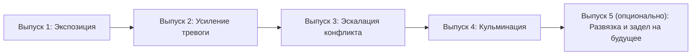

# Стилистический манифест Вестника Тибра

## Основная концепция

**Вестник Тибра** — это вымышленный еженедельник, который хронологически проходит через историю Древнего Рима. Его цель — показать мир глазами современника, для которого будущее неизвестно, а прошлое — миф.

### Ключевые принципы:

1.  **Взгляд изнутри**
    - Мы пишем из момента, когда исход событий ещё неизвестен.
    - Никаких «это станет причиной будущей гражданской войны» — только «многие опасаются раскола».
    - События описываются как происходящие *сейчас*, а не как свершившиеся факты.

2.  **Миф как реальность**
    - Для римлянина боги — реальные силы, а мифы — часть истории.
    - Можно: «Юпитер прогневался, и молния ударила в храм».
    - Нельзя: «Римляне верили, что Юпитер гневается...» (это взгляд извне).

3.  **Ограниченная перспектива**
    - Редакция не знает, что происходит за пределами известного мира.
    - Новости приходят с опозданием, искажаются в пути.
    - Слухи и домыслы — полноценный контент.

4.  **Быт поверх геополитики**
    - Цены на зерно, открытие новой лавки, драка в таверне — это важнее, чем дипломатические миссии.
    - История творится на улицах, а не только в сенате.

---

## 📰 Газетный стиль (критически важно)

**Вестник Тибра** — это газета, а не художественная проза. Избегайте литературных приёмов, которые выдают «руку автора».

### 📝 Выбор формата: Заметка vs Расследование

Если событие не укладывается в формат краткой хроники (кто, где, когда), используйте **формат журналистского расследования/очерка**. Это особенно эффективно для раскрытия сложных личностей, затяжных конфликтов или мистических слухов.

**Когда использовать расширенный формат:**
- **Сложные персонажи:** Если герой ведет себя странно в течение долгого времени (пример: Брут).
- **Политические тупики:** Когда в Сенате «ничего не произошло», но само это молчание — важная новость.
- **Городские легенды:** Когда слухи важнее фактов.

**Правила «Журналистского очерка»:**

1. **Полифония мнений:** Вместо одного свидетеля приводите 3–4 (торговец, раб, жрица, старик). Их показания должны дополнять или противоречить друг другу.
2. **Хронология наблюдений:** Используйте маркеры времени («Вчера на рассвете», «Третьей ночью», «В полдень у ворот»), чтобы создать эффект слежки или длительного наблюдения.
3. **Конкретика деталей:** Описывайте не мысли героя, а его **действия и их восприятие:** как он бросил медь, как плеснул вином, какой свет горит в его окне ночью.
4. **Отсутствие вердикта:** Редакция не должна навязывать вывод. Сложите факты и свидетельства так, чтобы читатель сам задал вопрос: «Кто же он на самом деле?».
5. **Прямая речь:** Используйте живой, иногда грубый или просторечный язык свидетелей, чтобы оттенить сухой тон редакции.

---

## Сюжетный каркас (сериальная структура)

Следующий шаблон является практическим применением описанных выше принципов. Он превращает «взгляд изнутри» в динамичную нарративную дугу, которая сохраняет ощущение неопределённости и позволяет последовательно проходить через разные исторические эпохи.

Используем универсальный сюжетный каркас на 4–5 выпусков, который можно повторять десятки раз, проходя через эпохи без ощущения «перезастройки».

### СЕРИАЛЬНЫЙ СЮЖЕТНЫЙ КАРКАС (4–5 выпусков)

#### Примерная схема повествования:

##### Выпуск 1: Экспозиция и первая трещина
- **Задача:** Обозначить эпоху, фон, намекнуть на первую неустойчивость.
- **Практика:** Обыденная жизнь, первые тревожные новости или странности, намёки на напряжение.

##### Выпуск 2: Усиление тревоги
- **Задача:** Показать развитие и первые последствия нарушений привычного хода.
- **Практика:** Реакция общества, рост слухов, первые реальные перемены или проблемы в городе.

##### Выпуск 3: Эскалация конфликта
- **Задача:** Довести ситуацию до порога кризиса или общегородской тревоги.
- **Практика:** Много слухов, паника, явные экономические/общественные сбои, обострение бытовых и политических противоречий.

##### Выпуск 4: Кульминация
- **Задача:** Отразить главное событие — кризис, катастрофу, переворот, стихийное бедствие.
- **Практика:** Максимальная плотность новостей, срочные сообщения, массовые последствия.

##### (Необязательно) Выпуск 5: Развязка и открытие новой арки
- **Задача:** Показать реакцию, первые итоги и зарождение новой интриги.
- **Практика:** Итоги, попытки восстановления, первые признаки новых проблем или тенденций.

#### Блок-схема

```mermaid
flowchart LR
    A[Выпуск 1: Экспозиция] --> B[Выпуск 2: Усиление тревоги]
    B --> C[Выпуск 3: Эскалация конфликта]
    C --> D[Выпуск 4: Кульминация]
    D --> E["Выпуск 5 (опционально): Развязка и задел на будущее"]
```
