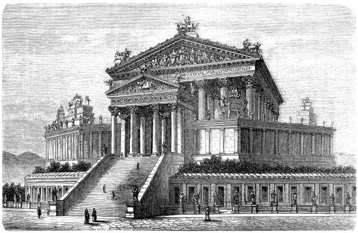
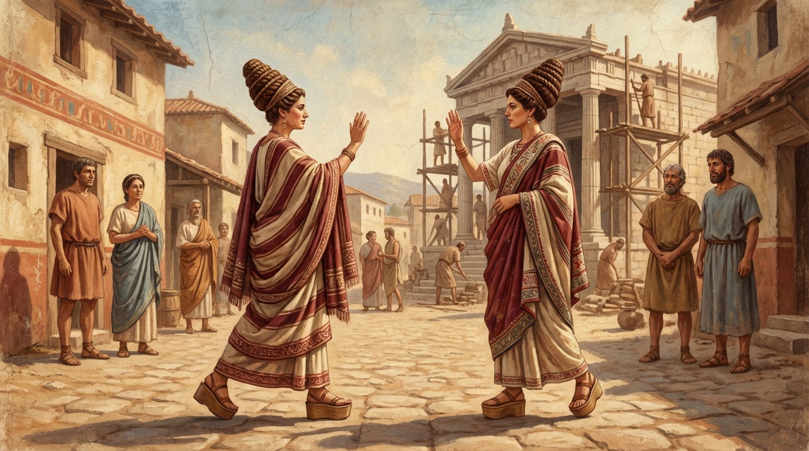

## 🔥 Топ новостей этой недели

 

  

### Великий храм возвышается над Форумом

Мы видели, как десятки рабочих поднимают гранитные блоки на лесах — и теперь колонны храма Юпитера Капитолийского достигли высоты трёх человеческих ростов. Царь Тарквиний лично осматривал стройку на прошлой декаде и приказал удвоить число мастеров. «Пусть весь мир увидит величие нашего города», — говорил он, стоя под временным навесом, пока жрецы совершали очистительный обряд.

Некоторые старики на Форуме шепчутся: слишком много богам обещано, слишком много людской гордости вложено в камень. Но мы видим и другое — как римляне замирают перед лесами, поднимая взгляд к небу, которое скоро укроет крыша.

### Новый указ о трудах на благо города

Царь издал распоряжение: каждый свободный мужчина без ремесла должен отработать тридцать дней в год на общих стройках. За это — хлеб из царских амбаров и право называться *фабром* — строителем города. Уже сотни пришли записываться у ворот Палатина. «Мудрое решение», — говорит Маний Курий, торговец оливковым маслом, — «пусть праздные руки приносят пользу, а не дрязги».

Другие голоса звучат тише. В таверне у Трёх Сосен мы слышали: «А если не захочу строить? Если земля моя зовёт?» Ответа нет — указ не знает исключений.

### Сын царя возвращается с войны

Секст Тарквиний прибыл в город на рассвете вчерашнего дня, до того как жара поднялась. Его отряд прошёл через ворота с девятью повозками добычи — бронза, пурпурное сукно, пленники в цепях. Говорят, он сам вёл переговоры с латинскими вождями и клялся, что «Рим будет стоять, пока стоит мой меч».

Женщины на улицах Целия закрывали лица при виде пленных — молодых, с ожогами от верёвок на запястьях. «Такова война», — сказала нам полноватая торговка фруктами, — «но много ли нужно, чтобы из пленника сделать римлянина?»

---

## 💰 Новости экономики и торговли

### Зерно дорожает, а ветер приносит тревогу

Модий пшеницы на Эсквилине — уже за семь либр бронзы, и торговцы качают головами. «Не помню такого в мае», — бормочет старый Вентидий, чья семья три поколения мерит зерно на том же месте. Причина — влажная весна в Кампании, говорят пришедшие с юга. Поля стоят в воде, посевы гниют.

Царские склады открыты, но хлеб оттуда — только за труд на стройках. Обычный покупатель ищет у частников, и те держат цену. Вчера на рынке мы видели потасовку: женщина с ребёнком на руках ударила продавца половником, обвинив в наживе на голодных. Царские ликторы разняли, но настроение — неспокойное.

Мелкие торговцы адаптируются. Луцилия, продавщица пряностей у Храма Кастора, начала принимать в уплату медные украшения — «переплавлю, продам, пережду». Другие переходят на ячмень, просо, горох. «Рим не голодал ещё», — говорит она, перебирая кориандр, — «но я помню, как моя мать рассказывала о годе, когда ели жёлуди».

### Новая мастерская на Велабре

Грек по имени Дамофил открыл лавку позолоченных изделий — первую в нашем городе, где работают только свободные мастера, без рабов. «Рука, которая знает свободу, лучше чувствует металл», — объявил он, вывешивая вывеску с изображением Минервы с кадуцеем. Уже три заказа на посуду для культовых трапез — жрецы, кажется, не прочь поэкспериментировать.

---

## 🎭 Новости культуры и быта

### Новый обычай: огни на крышах

На прошлой неделе в ночь перед полнолунием мы видели нечто странное — десятки точек света на склонах Палатина и Целия. Люди зажигают масляные лампы на кровлях, «чтобы боги видели, где живут римляне». Никакого указа, никакого жреца — просто сосед перенял у соседа, и вот уже вся улица горит до рассвета.

Старшины квартала беспокоятся о пожарах, но молодёжь ликует. «Когда светят все, тьма отступает», — сказала нам девушка с кувшином на плече, спускавшаяся к фонтану. Кто первый зажёг — неизвестно. Может, это был знак? Может, кто-то ждал весточки?

  

### Мода на этрусское

Жёны знатных домов носят теперь высокие, в форме конуса причёски — «как у матрон из Вейи», говорят. Платья с широкими полосами, туфли на толстой подошве, даже манера приветствовать — ладонь к ладони, не кулак к груди. «Они забывают, откуда родом Тарквинии», — шепчет старая патрицианка у дверей храма Весты, — «но этруски тоже люди, и боги их слушают».

Мы видели, как жрица Весты молча смотрела на проходящую этрусским шагом женщину. Взгляд был неосуждающий — просто внимательный, как у той, кто знает, что всё видит огонь очага.

---

## ⚠️ ЧП и происшествия

### Пожар на Субуре

В ночь на третий день недели вспыхнул сарай у кожевенной мастерской Аврелия. Мы прибежали на крик — пламя уже приближалось к соседней лавке с овощами. Соседи образовали цепочку с вёдрами, кто-то вытащил осла, кто-то — мешки с солью. Жар был такой, что нельзя подойти ближе двадцати шагов.

Погасили к утру. Ущерб — три сарая, часть запасов, осёл с ожогами (выжил, но не сможет тащить). Причина, говорят, — лампа, упавшая с полки. Или удар молнии, хотя небо было ясным. Или... но здесь голоса смолкают, и взгляды убегают в сторону храма Юноны на Авентине, где в тот же вечер жрецы находили приметы — ворона, севшую на левое крыло статуи.

Мастер Аврелий молится обещанным жертвоприношением. Соседи помогают расчищать золу. Город живёт дальше — но запах гари ещё витает над улицей, и дети собирают обгоревшие доски как трофеи.

### Исчезновение вольноотпущенника

Публий, недавно отпущенный на волю бывшими хозяевами из дома Пинариев, не явился на встречу кредиторов и не ночевал дома три дня подряд. Рабы Пинариев обыскали его комнату — нашли только дощечку с неразборчивыми цифрами и кусочек воска. Долги? Заговор? Бегство к родичам в Тускул?

Префект пока не вмешивается — вольноотпущенник не раб, не полноправный гражданин. Пинарии обещают награду тому, кто встретит его или скажет, где искать. «Хороший был писец», — говорит старший в доме, — «неужели сам навлёк беду себе?»

---