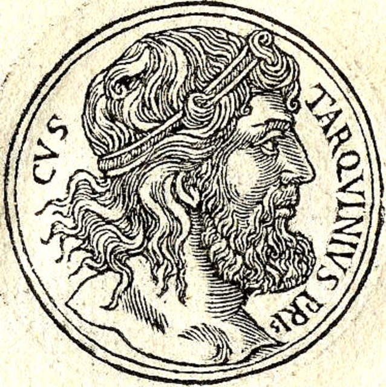
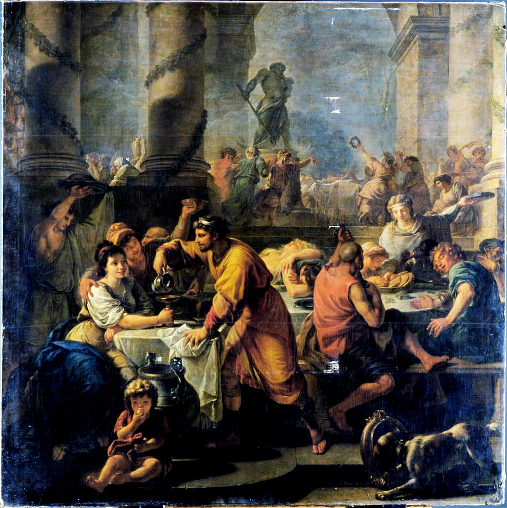

## 🔥 Топ новостей этой недели
 

  

### Царь Тарквиний Приск объявил новые строительные работы
Горожане обсуждают грандиозные планы царя: начато возведение каменного форума и каналов для отвода воды. По словам приближённых, это укрепит город и сделает его достойным соперником этрусских центров. Торговцы радуются: *«Теперь у нас будет место для сделок и собраний»*

### Соседи из Вейи усиливают войско
По слухам, этрусский город Вейи собирает дружины. В Риме опасаются возможных набегов. Сенаторы призывают граждан готовиться к обороне и приносить жертвы богам.

---

## 💰 Новости экономики и торговли

### Зерно дорожает
Из-за засухи в Кампании цены на зерно выросли. На рынке у Тибра хлеб стоит почти вдвое дороже, чем весной. Бедняки жалуются, а землевладельцы подсчитывают прибыль.

### Новые ремесленники из этрусских земель
В город прибыли мастера, умеющие работать с бронзой и украшениями. Их изделия уже появились на рынке — особенно популярны украшенные фибулы и сосуды.

---

## 🎭 Новости культуры и быта

  

### Праздник Сатурналий прошёл шумно
На улицах царило веселье: рабы и хозяева менялись ролями, звучали песни, раздавали сладости. Многие жалуются на шум и беспорядок, но молодёжь довольна: *«Такого веселья давно не было!»*

### Первая каменная дорога
Жители восторгаются новой дорогой, ведущей к храму Юпитера. *«Теперь не будем вязнуть в грязи»*, — говорят горожане.

---

## ⚠️ ЧП и происшествия

### Пожар в лавке гончара
На этой неделе огонь уничтожил мастерскую на окраине форума. Соседи успели вынести часть товара, но сам гончар лишился всего. Горожане собирают пожертвования.

### Спор о границах
Две семьи из пригорода устроили драку из-за участка земли. Дело передано на рассмотрение царю.