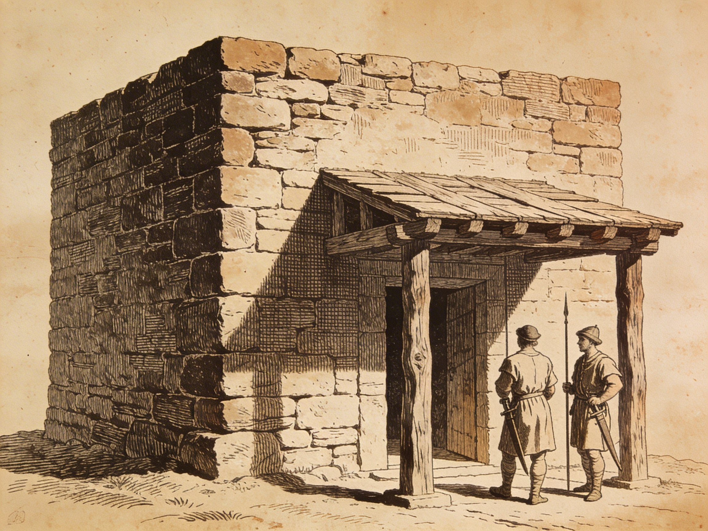
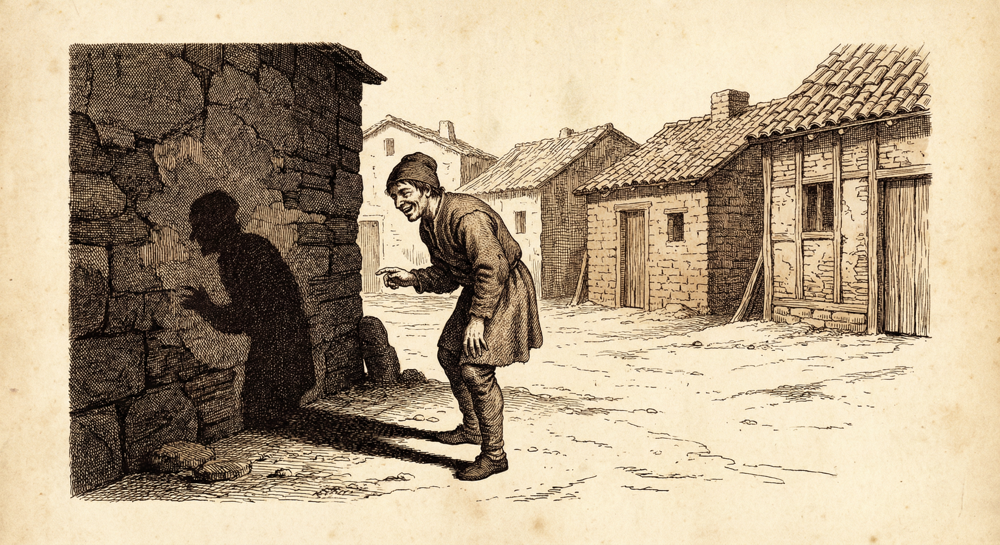
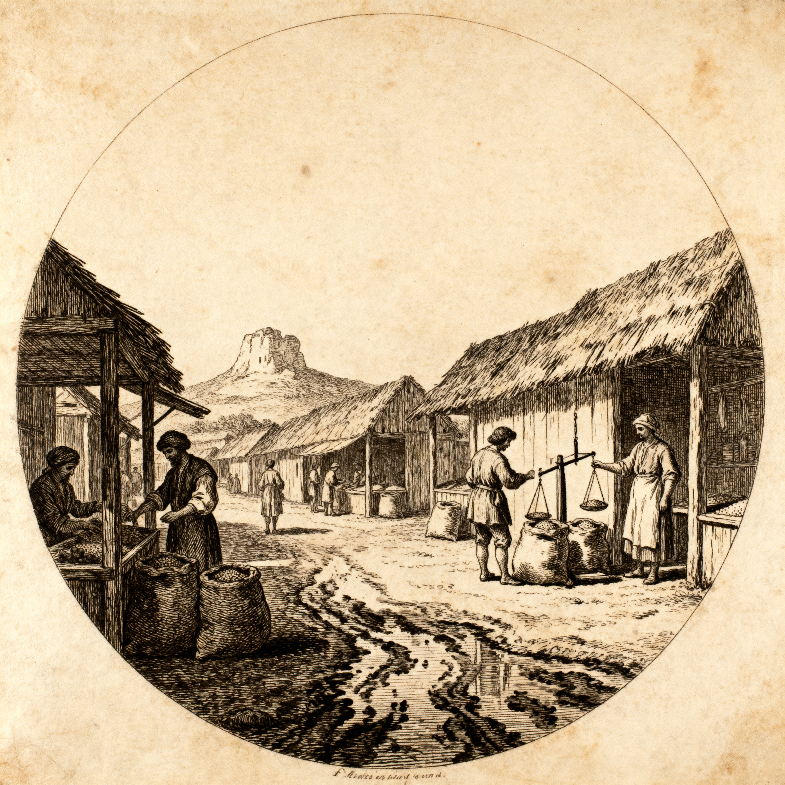

## 🔥 Топ новостей недели

  

### Обсуждения в курии

В минувшие иды сенат созывали дважды. Официально — «по вопросу учёта зерна». Но наши источники расходятся в том, что происходило за закрытыми дверями.

Виатор, выносивший пустые таблички, сказал нашему человеку: «Царь требовал имен. Сенаторы молчали». По его словам, Луций Тарквиний стоял у стола, кулаком по дереву бил.

Торговец вином, поставляющий в курию, слышал обрывки: кто-то из старших сенаторов сказал «не по закону», царь ответил «закон — я». Больше ничего не разобрать.

Раб из дома Валериев рассказал хозяйке: его господин вернулся поздно, плащ в грязи, сказал жене лишь: «Готовь детей к отправке». Куда и зачем — не пояснил.

Официального указа не последовало. Но стража у курии осталась — стоит и ночью.

---

### Писцов бьют на улицах

Трое учётчиков зерна не пришли к вечеру в канцелярию. Двое нашлись в лечебнице у Эсквилина — избиты, таблички отобраны. Третий не найден.

«Шли через Велабр, — говорит хозяин лечебницы, — принесли на носилках. Один без сознания, другой бормочет про «маски» и «нож». Больше ничего не говорит».

Царская стража оцепила квартал у поворота к Форуму. Стоят до ночи. Прохожих спрашивают, но не задерживают.

---

### Слухи о заговоре множатся

На рынках шепчутся: некоторые патриции собирались в домах ночью. Факелы видели у ворот Валериев и Юниев.

«Сами видели, — говорит продавец масла с Авентина. — Три ночи подряд. А утром стража стоит, как ни в чём не бывало».

Царские люди велели не разносить слухов. Но шёпот не унимается — слишком много совпадений.

---

  

### «Он смеялся над тенью, но глаза были... какие?» Загадка Луция Юния

В городе всегда есть свой дурак. Но Луций Юний Брут — особый случай: он дурак уже который год, и вдруг перестал быть смешным.

**Позавчера, третий час**. Торговец рыбой Квинт продавал сардины у поворота к Форуму, когда Брут прошёл мимо. «Стоял у колонны, — говорит Квинт, — и действительно смеялся. Но не так, как обычно. Обычно — хихикает, плюётся, крутится. А тут — стоял смирно, лицо к солнцу, и смеялся. Тихо. Как будто кого-то слушает».

**Вчера, пятый час**. Мясник Марк спорит: «Напевал? Не напевал! Я ему весил солонину, гляжу — губы шевелятся. Спрашиваю: «Чего жужжишь, патриций?» А он мне медью бросил — точно в руку, без промаха — и говорит: «Считаю, сколько тебе осталось». И ушёл. Дураки так не бросают».

**Сегодня, рассвет**. Жрица из храма Весты (просила не называть имени) рассказала: «Упал на ступенях. Не споткнулся — просто пал на колени, долго стоял так, лбом к земле. Потом встал, одежду отряхнул — и пошёл, как ни в чём не бывало. Я подумала: молится. Но дураки не молятся. Они... не умеют».

**А вот что страннее всего**. Мастер-медник Луций живёт в соседнем доме. «Ночью, после полуночи, свет в его окне. Не лампада — лампады тлеют жёлтым. Это светчето, белое. До второго часа горит. Иногда — до третьего».

Старый сенатор, проходивший мимо, услышал это и сказал: «Пишет. Дураки не пишут ночами. Они спят».

Так кто он — дурак, которому вдруг стало страшно, или мудрец, который притворяется? Или, что хуже — третье?

Мы спросили его самого. Брут посмотрел сквозь нас, рассмеялся — громко, по-дурацки — и плюнул в тротуар. Мокрое пятно осталось на камне. Он на него посмотрел, кивнул и пошёл дальше.

---

## 💰 Новости рынка

  

### Полба подорожала вдвое за пять дней

Мера полбы, которую на прошлой неделе отдавали за три куска меди, теперь стоит шесть. Ячмень — четыре, горох — пять.

«Мешки приходят пустые, — говорит торговец с Остии. — А те, что есть, царские люди считают и печатают. Половину увозят».

Покупатели стоят в очередях с рассвета. К полудню прилавки пусты. Некоторые уходят ни с чем.

---

### Мастера жалуются на повинность

Гончары из низины за Эсквилином сообщают: каждого пятого забрали на работы к Капитолию. Без платы, на месяц.

«Печь остыла, — говорит мастер-горшечник. — Ученик один не справится. А заказчики ждут».

То же говорят плотники и каменотёсы. Храм Юпитера растёт, а лавки закрываются.

---

### Медь на вес принимают неохотно

Торговцы у Тибра требуют товар на товар. Медь на вес берут с недовольством.

«Куски проверяют дольше, — говорит меняла у моста. — Режут, пробуют на зуб. Раньше быстрее было».

Некоторые вообще отказываются — ждут серебра. Откуда серебро у простого человека, неясно.

---

## 🎭 Новости культуры и быта

### У источников толпы с вёдрами

Родниковый бассейн у Ютурны не справляется. Люди стоят с третьего часа до девятого.

«Вчера женщина упала в обморок, — рассказывает носильщик воды. — Унесли. Место сразу заняли».

Царские люди обещали «наладить сток», но пока ничего не изменилось. Вёдра пустеют быстрее, чем наполняются.

---

### Жрецы увеличили жертвы

В храме Весты сожгли трёх овец вместо одной. Жрицы говорят: «За город».

«Дым стоял над Форумом до вечера, — говорит пекарь рядом. — Пепел падал на прилавок. Покупатели морщились, но брали хлеб».

Авгуры не объявляют знамений публично. Но лица у них мрачные.

---

### Дети играют в «царя и писца»

На пустыре у Эсквилина дети делятся на две кучи. Одни — «царские», с палками. Другие — «писцы», с дощечками.

«Писцов» ловят и «бьют» палками по спине. Родители не вмешиваются — пусть играют.

Одна мать сказала: «Лучше пусть здесь учатся, чем на улице попадут под носилки».

---

### В винных лавках тише обычного

В харчевнях у Форума чаще обсуждают новости шёпотом. Раньше спорили громко, стуча кружками по прилавку.

«Слышал, что писца нашли в Тибре, — сказал один мужчина у стойки. — Другой ответил: «Молчи, стены слышат». Больше не говорили».

Хозяин харчевни велел рабам не подслушивать. Но глаза у рабов бегают.

---

## ⚠️ ЧП и происшествия

### Нападение на сборщика подати

У ворот Тригемин сборщик не досчитался двух мешков ячменя. Когда потребовал показать — получил камнем в плечо.

«Убежали в переулок, — говорит стражник. — Трое было, может больше. Лиц не разглядели».

Сборщик перевязан, мешки не найдены. Стража прочёсывает квартал.

---

### Пропал сын ремесленника

Молодой человек, 18 лет, не вернулся от поставщика глины. Искали всю ночь — не нашли.

«Ушёл после второго часа, — говорит отец. — Сказал, что к обеду вернётся. Не пришёл».

Табличку с долгом нашли у ворот. Пустую. Никто не видел, куда ушёл.

---

### Драка у винной лавки

Двое мужчин поссорились из-за меры вина. Один ударил другого кувшином.

«Оба были пьяны, — говорит сосед. — Один уснул на месте, другого унесли друзья».

Хозяин лавки сказал: «Вино разбавлять перестали — вот и злее стали». К вечеру оба разошлись.

---

### Пожар в мастерской кожевника

Сгорела крыша, инструменты погибли. Хозяин говорит: «Уголь тлел в яме. Ветер подул — и всё».

Стража проверила — поджога не нашла. Но соседи шепчутся: «Слишком вовремя».

Мастер обещал восстановить за месяц. Заказчики ждут.

---

*Выпуск подготовлен редакцией Вестника Тибра. Следующий номер выйдет через семь дней.*