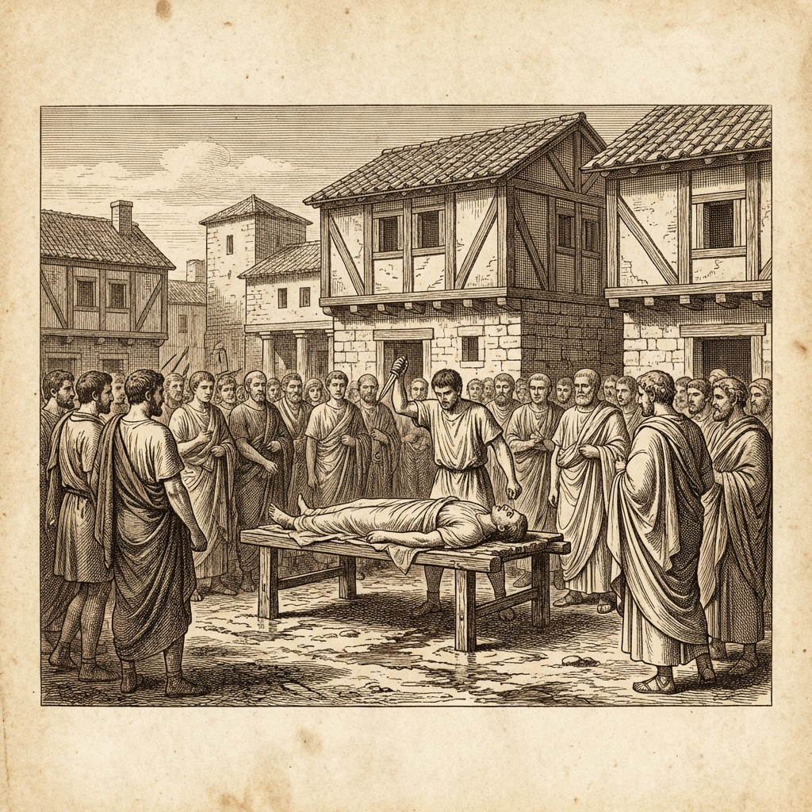
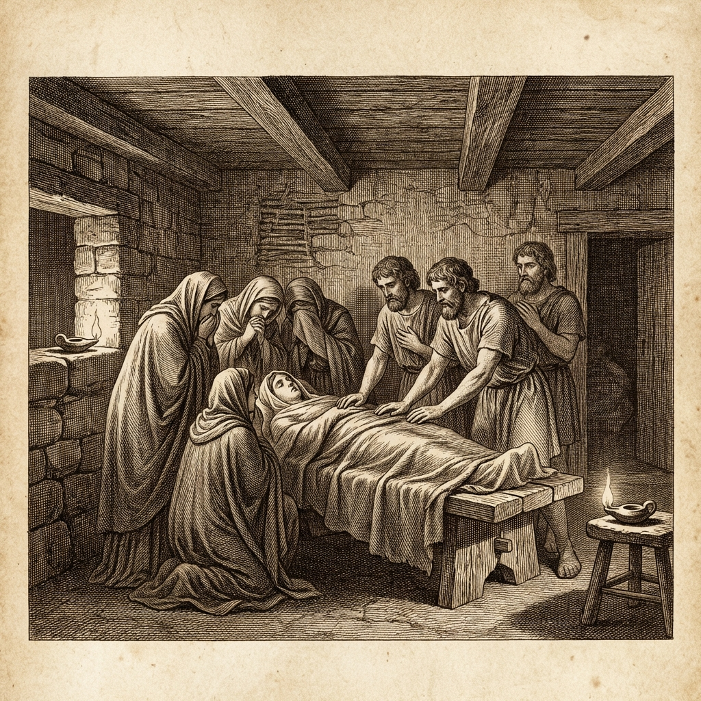

## 🔥 Темы недели

 

  

### События в доме Коллатина

Вчера на рассвете гонцы принесли весть из Коллации. Лукреция, жена Луция Тарквиния Коллатина, найдена мёртвой в своих покоях. В руке — кинжал. В груди — рана.

Отец её, Спурий Лукреций, и муж прибыли в Рим сегодня утром. Они не одни. С ними человек, которого мы знали как Брута-Простодушного.

Сначала поклялись в доме Коллатина, позже тело показали на Форуме. Брут выхватил кинжал из раны покойной. Он показал его толпе. Свидетели говорят, он говорил громко и отчётливо, слышали даже на краю площади. Он клялся, что изгонит род Тарквиниев. Толпа отвечала криком.

Царь был на войне, под Ардеей. Когда весть дошла до лагеря, он двинулся назад. Но ворота Города закрыты. Стража ворот говорит, что получила приказ не впускать царя и его людей.

### Сенат не заседает

Курия закрыта. Старейшины не выходят. Виаторы стучатся в двери, но ответа нет. Ходят слухи, что некоторые отцы поддержали Брута. Другие прячутся в домах, боясь гнева царской стражи.

Над Капитолием кружили вороны. Жрецы говорят, что это знак, но какой — не поясняют.

### Царь у стен

К полудню царь подошёл к стенам. Его не пустили. Он требовал впустить хотя бы детей. Ему отказали.

Говорят, Секст Тарквиний, сын царя, бежал в Габии. Теперь там, по слухам, собираются вооружённые люди.

---

## 💰 Новости рынка

### Торговля остановилась

Лавки на Велабре закрыты. Торговцы зерном не выносят товар. Цены на полбу выросли втрое за утро. Некоторые меняют зерно на соль и масло, медь на вес брать отказываются.

Прилавки с рыбой у реки пусты. Лодочники боятся приставать к берегу у Сублиция. Говорят, что там стоят люди с дубинами и проверяют каждого.

### Мастерские не работают

Гончары и кузнецы не работают. Глина в печах остыла. Мастера говорят, что боятся повинностей. Если царь вернётся, он заберёт всех на стены. Если не вернётся — кто заплатит за хлеб?

Владельцы складов у реки опечатывают амбары. Стражи нет, грабежа пока не было, но люди запасаются водой и дровами.

---

## 🎭 Новости культуры и быта

  

### Траур в домах

Женщины не украшают волосы. На улицах видно больше чёрной шерсти, чем обычно. В домах зажигают лампы днём — боятся темноты.

У алариев (домашних богов) ставят лишние чаши с вином. Матери не выпускают детей за порог. Игры на Марсовом поле отменены.

### Знаки богов

Старик у источника Ютурны видел, как вода покраснела. Другие говорят, это глина со дна. Жрецы весталки молчат.

В строящемся храме Юпитера на Капитолии упала балка. Рабочие говорят, что дерево было сухое. Мастера шепчутся, что фундамент осел.

### Клятва у тела

Тело Лукреции не сожгли. Его вынесли на Форум. Мужчины клали руки на грудь покойной и клялись мстить за бесчестье. Женщины плакали в платки.

Брут сказал, что теперь Рим будет без царя. Люди спорят, кто будет отдавать приказы: старейшины, военные начальники или кто-то иной. Но клятва принесена.

---

## ⚠️ ЧП и происшествия

### Столкновение у ворот

У Коллинских ворот произошла стычка. Люди царя пытались пройти внутрь. Вооружёные жители перекрыли проход брёвнами.

Были пущены камни. Трое царских слуг ранены дубинами. Один упал с стены, сломал шею. Тело унесли друзья.

### Пожар в низине

В низине за Эсквилином горел дом. Огонь быстро потушили, но сгорели записи должника. Хозяин кричал, что это поджог. Соседи говорят, что искра попала от очага.

### Пропажа писцов

Двое писцов, которые вели учёт зерна для царя, не пришли домой. Жёны ищут их у курии. Там говорят, что их не видели.

---

## 📜 От редакции

Мы пишем это, пока на улицах многолюдно. Царь стоит за стенами. Внутри — клятва.

Брут, которого считали безумным, теперь ведёт людей. Коллатин, муж покойной, стоит рядом. Старейшины не выходят из курии.

На рассвете ожидается собрание на Форуме. Стража усилена у ворот.

*Редакция продолжит следить за событиями. Следующий выпуск выйдет, когда станут известны решения старейшин.*