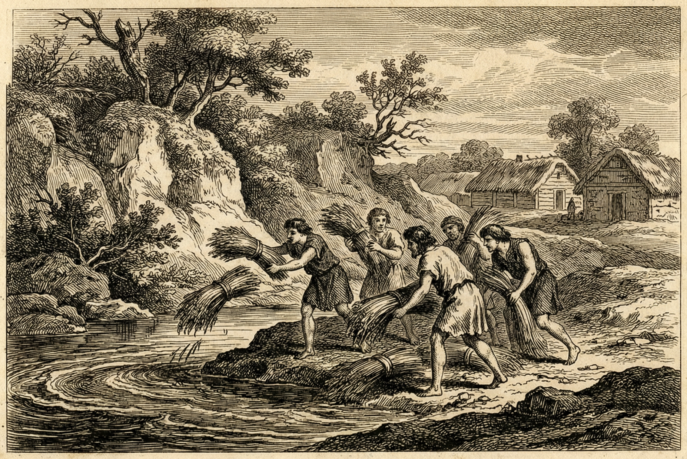

## 🔥 Темы недели

 

  

### Жатва, отданная реке
Вчера на рассвете обширное поле за городом, принадлежавшее изгнанному царю, было торжественно передано богу Марсу. Отцы-сенаторы постановили, что имущество тирана не должно кормить ни одного жителя. 

Колосья полбы, уже собранные в снопы предыдущими сборщиками, жрецы приказали выбросить в Тибр. Уровень воды сейчас низок, и медленное течение сбило солому и зерно в большие заторы на отмелях ниже по течению. Люди из царских амбаров пытались возражать, указывая на то, что это зерно могло бы сбить цены на рынке, но их голоса потонули в криках толпы. Мелким торговцам под страхом изгнания запрещено вылавливать царскую полбу из воды.

### Двое вместо одного: новые магистраты
На Комиции народным голосованием были утверждены новые правители города — Луций Юний Брут и Луций Тарквиний Коллатин. Теперь их называют консулами.

Толпа с удивлением наблюдала за новыми порядками. Утром двенадцать ликторов с пучками розг (фасциями) шли впереди Брута. Однако, когда консул подъехал к Форуму, его ликторы опустили фасции перед собранием — знак того, что власть исходит от народа, а не от единого господина. Затем Брут и Коллатин обратились к центуриям, созданным ещё при Сервии Туллии, для переклички граждан. Тот, кого годами считали не в меру тихим и слабоумным, теперь обращается к собранию с непререкаемой твердостью. Брут взял клятву со всего народа: никогда не терпеть над собой царя. Горожане повторяли слова вслед за ним, воздевая руки к Капитолию.

### Ночные встречи у Соляной дороги

*Хотя на Форуме звучат речи о всеобщем согласии, по ночам на улицах происходит странное. Редакция собрала свидетельства о подозрительных перемещениях молодых людей из родов Тарквиниев и Вителлиев.*

Днем они стоят в первых рядах собрания. Но когда солнце садится за Яникул, некоторые сыновья из древних родов ведут себя так, словно им тесно в новом порядке.

* **Старик-угольщик у ворот:** «Третьей ночью мимо моего навеса прошли пятеро. Плащи плотные, лиц не разобрать, но сандалии дорогой кожи. Один уронил кусок меди, даже не нагнулся поднять. Они шли не к тавернам, а к северной дороге, туда, где старые гробницы».
* **Раб-водонос из дома Вителлиев:** «Мой молодой господин перестал спать. Вчера велел мне чистить конскую сбрую в полночь. Сказал, что скоро ленивые дни закончатся, и настоящие хозяева возьмут свое. Касался амулета, когда говорил о консулах».
* **Женщина на рыбном рынке:** «Они собираются у заднего двора дома Аквилиев. Я видела послов... Не наших. У тех были дорогие этрусские застежки на плащах. Молодые господа наливали им неразбавленное вино. Никто так не принимает друзей, если не хочет скрыть беседу от чужих ушей».

Консул Брут пока не комментирует эти слухи. Его собственные сыновья вчера допоздна оставались на площади в компании юных Тарквиниев.

---

## 💰 Экономика и торговля

### Конец царских повинностей
Сразу после изгнания тирана новое правительство объявило о прекращении принудительных строительных работ. Ремесленники, которых месяцами сгоняли для углубления Большой канавы и тески туфа на Капитолии, вернулись в свои кварталы. 

Однако часть мастеров, трудившихся на горе, отказывается сейчас подниматься на высоту, пока сенат не подтвердит выплату медью за прошлый месяц. На рынках царит оживление, но и неразбериха. Десятки плотников и каменщиков требуют расчёта за выполненную работу, однако царские писцы исчезли вместе с записями. Отцы-сенаторы обещают разобрать жалобы к следующему полнолунию.

### Цены на полбу ползут вниз
Устранение царской монополии на оптовые закупки зерна дало свои плоды. Купцы, ранее боявшиеся конфискаций со стороны дворцовых стражников, снова пригоняют тяжело груженые повозки со стороны Латия. Мера ячменя сегодня обходилась в небольшой литой слиток меди — по весу примерно в унцию. Торговцы яблоками и бобами также снизили цену, опасаясь, что их товар сгниёт на жаре.

### Небывалый спрос на пограничные камни
Резчики по камню в долине между холмами работают без отдыха. Избавление от царских земельных списков привело к тому, что вчерашние соседи бросились заново размечать свои участки. Хозяева заказывают тяжелые туфовые столбы для бога Термина, чтобы навсегда закрепить границы дворов. Не обходится без драк: у источника Карменты две семьи сцепились прямо над ямой для камня, утверждая, что дед одного из них уступил землю под давлением людей царя.

---

## 🎭 Культура и быт

 

  

### Знамение над городом
Вчера утром над собравшимся народом пролетел орел. Птица плавно прочертила небо слева направо — со стороны Капитолия к Палатину, совершив благоприятный виток (auspicium ratum). Жрецы-авгуры, наблюдавшие за полетом, объявили знак исключительно благоприятным. Птица не сделала резких движений и не кричала, что растолковали как волю Юпитера: два правителя не принесут городу раздора, а их власть будет прочной, как скала.

### Обида домашних ларов
Несмотря на радость перемен, пожилые матроны выражают беспокойство. Поспешное уничтожение царственных символов и спешная перестройка алтарей у некоторых ворот, по их мнению, тревожит древних духов места. Женщины, набирающие воду у каменного бассейна у подножия Целия, жаловались, что вода вчера отдавала глиной. Многие сплевывают через левое плечо и приносят дополнительные жертвы домашним ларам, чтобы защитить свои очаги в эти неспокойные дни.

---

## ⚠️ ЧП и происшествия

### Тревожные вести с северных пастбищ
Сегодня утром несколько пастухов вбежали в городские ворота без стад. Они сообщили о появлении вооруженных разъездов на северных холмах, где традиционно пасётся городской скот. По их словам, люди говорили по-этрусски и расспрашивали о численности стражи у ворот Рима. Более тридцати голов скота бесследно исчезли. Ходят упорные слухи, что в городе Вейи собирается ополчение. Консулы отправили туда верховых разведчиков для прояснения ситуации. 

### Пожар в квартале гончаров
Сильный ветер с реки вчера раздул огонь в одной из гончарных печей. Пламя перекинулось на деревянный навес с готовой посудой. Усилиями соседей, забрасывавших огонь мокрой землей и песком, пожар удалось остановить до того, как пострадали жилые дома. Убытки составили три десятка свежих амфор.

### Ложный вызов на Форуме
В полдень на рынке вспыхнула паника: кто-то закричал, что люди царя вернулись с оружием. Торговцы побросали столы, несколько мешков с горохом были затоптаны в грязь. Как выяснилось уже через час, шум поднял подвыпивший крестьянин, принявший группу прибывших на телеге сабинских торговцев за царскую стражу. Нарушитель спокойствия задержан служителями Коллатина.