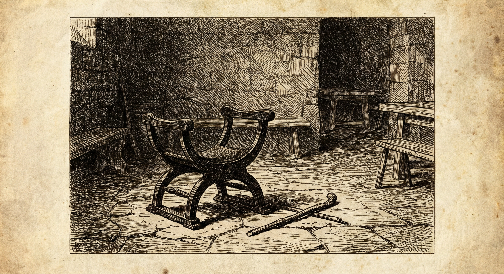

  

## Пыль оседает, вопросы остаются

Ещё в прошлые иды любой, кто посмел бы усомниться в вечности власти Луция Тарквиния, оказался бы в Туллиановом карцере под Капитолием — или же просто исчез, как тот вольноотпущенник с долговыми табличками. Сегодня имя царя стирают с каменных плит, а на Форуме правят два высших магистрата — консулы. 

Мы пережили раскол, уличные бои и бегство правителя. Но когда схлынул адреналин клятв и криков на Форуме, римляне начали задаваться вопросом: как именно это произошло? Была ли трагедия знатной матроны Лукреции единственной причиной бунта, или город уже давно сидел на бочке с сухим ячменем, ожидая искры?

Наши писцы побеседовали с теми, кто наблюдал за крахом монархии с разных холмов.

---

### Свидетельство I: Помолвка с камнем и глиной
*(Записано со слов старшего мастера-строителя из низины за Эсквилином)*

«Вы спрашиваете, почему плебс так легко взялся за колья и поддержал патрициев? Посмотрите на Капитолийский холм. Храм Юпитера огромен, да. Но кто таскал туда туф? Мы. При царе Сервии нас призывали на войну, а при Тарквинии нас приравняли к рабам. Моих племянников забрали рыть канавы в низине Велабра, чтобы отводить нечистоты. За это не платили медью, за это не давали полбы. Полгода ремесленные лавки стояли закрытыми, потому что хозяева гнули спины на царских стройках. 

Когда Брут и Валерий вышли на Форум и пообещали, что свободный римлянин больше не будет рабом на стройке, толпа взревела не от горя по Лукреции. Она взревела от боли в собственных спинах. Первое, что сделали новые консулы, — **отменили эти повинности**. Сегодня утром я видел, как гончары впервые за долгое время разжигали печи для своих заказов, а не для царской крыши».

---

### Свидетельство II: Удушье в Курии
*(Записано со слов клиента одного из старейших сенаторских родов. Имя скрыто по его просьбе)*

«Обычным людям кажется, что переворот зрел на улицах из-за цен на зерно. Но настоящий заговор пах благовониями и кровью в домах отцов-сенаторов. Царь годами не созывал Сенат для совета. Он судил единолично, разбирал дела о наследстве за закрытыми дверями. Сколько достойных мужей из патрициев было казнено или отправлено в изгнание под ложными предлогами? Их имущество уходило в царскую казну — вот откуда бралось золото на этот бесконечный Капитолийский проект.

Патриции были в ужасе, но молчали. Ждали повода. Клятва над окровавленным ножом, которую принёс Брут, стала единственным способом связать всех круговой порукой. Отступать было некуда. Теперь, когда власть у двух консулов, Сенат снова дышит. Но я скажу вам то, о чем шепчутся в атриумах: многие патриции уже скрипят зубами из-за того, что консулам приходится заискивать перед толпой».

---

### Загадка Луция Юния Брута: Глупец или Игрок?
*(Аналитическая записка наших наблюдателей на Форуме)*

Самая темная фигура этих дней — Луций Юний Брут. Мы все помним племянника царя как человека недалекого ума. Его выходки вызывали насмешки. Называли ли его "Брутом" за глаза? Нет - ему говорили это в лицо.

И вдруг этот же человек произносит речь, от которой у старейших трибунов перехватывает дыхание. Он организует блокировку ворот, четко распределяет людей по стенам и берет власть на комициях. Человек не учится командовать гарнизоном за одну ночь. 

Беседуя с людьми на улицах, наши писцы слышат две версии. Первая (которую уже объявляют жрецы): в момент горя боги коснулись разума Брута и вложили в него мудрость. Вторая (о которой говорят полушёпотом в тавернах): Брут годами носил маску слабоумного, чтобы выжить во дворце Тарквиния, методично готовя сегодняшний день. Если верно второе, то кто сейчас управляет Римом? Герой или самый холодный и расчетливый политик в истории Города?

---

### От редакции

Редакция «Вестника» не берется судить, устоит ли новая власть, или же нас ждет возвращение монарха с чужеземным войском. Ясно одно: старый Рим закончился. В новом — приходится спать вполглаза и крепко запирать амбары. Мы продолжаем следить за улицами.