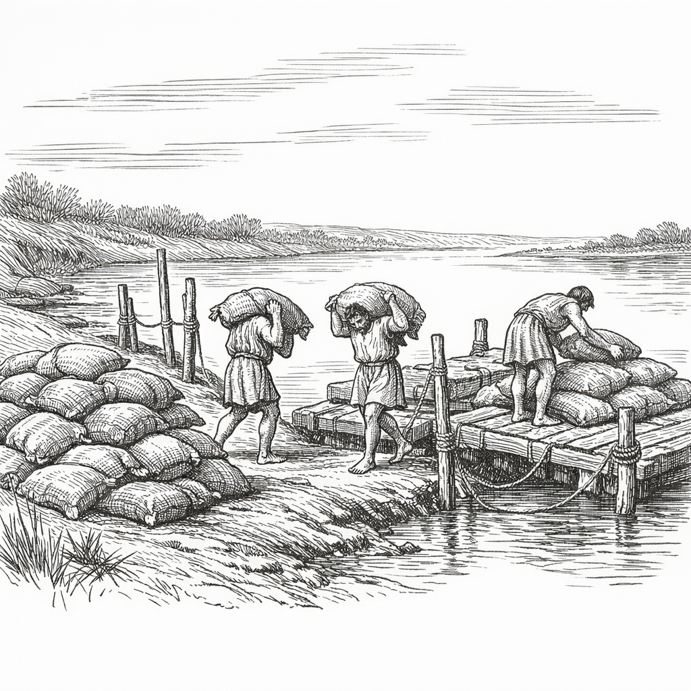
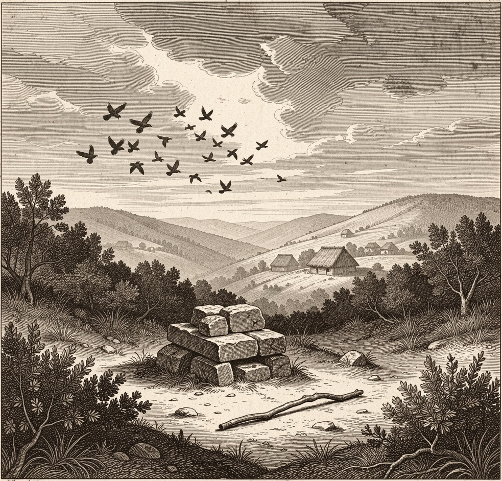

## 🔥 Темы недели

### Тень имени: Коллатин молчит, город говорит

На этой неделе на Форуме было очень много разговоров, почти как в день избрания консулов. Луций Тарквиний Коллатин, один из двух правителей города, появился у помоста у Комиция в третий день после Нон мая, но не сказал ни слова. Он стоял рядом с Брутом, молча, пока ликторы посохами отодвигали толпу

«Он носит имя, которое мы только что выбросили из города», — сказал нам торговец рыбой с Бычьего форума, пряча руки в складки туники. «Как можно служить Республике, если твоя фамилия напоминает о царях? Волка в загоне с овцами не держат — рано или поздно вгрызётся»

Другие свидетели утверждают иное. Старик, чистящий обувь у храма Весты, заметил: «Коллатин изгнал царя своими руками. Разве кровь смывается именем?». Однако толпа казалась неумолима. В курии шепчут, что некоторые сенаторы требуют от консула добровольного отказа от власти. Брут пока не вмешивается, но его лицо было каменным.

### Ночные встречи на Квиринале

Третьей ночью стража у Коллинских ворот сообщила о движении людей в тогах на Квиринальском холме. Это не были жрецы, совершающие обряды. Группа из пяти или шести молодых людей, судя по голосам — патрициев, собиралась у дома, где раньше жил царский посланник.

Они говорили тихо, но одно слово долетело до караула: «Возвращение». Стража не стала вмешиваться, опасаясь гнева знати, но записала имена тех, кто выходил на рассвете. Список передан консулам. Никто не берётся утверждать, что это заговор, но о тех, кто бывает на улицах после заката, стража теперь расспрашивает охотнее

---

## 💰 Новости рынка

  

### Вейи задерживают поставки

Три баржи с зерном, ожидавшиеся из Вей еще в прошлые Иды, стоят у берега без разгрузки. Капитаны ссылаются на «проверку весов» со стороны этрусских сборщиков пошлин. На самом деле, цена на модий пшеницы уже выросла на две унции меди.

Торговцы шепчут, что это политическое давление. Царь Тарквиний находится в изгнании, и города соседей ждут, кто победит в Риме: новая Республика или старая кровь. Если поставки не возобновятся к концу месяца, хлебные таберны на Субуре могут закрыться

### Соль подорожала из-за слухов

На Соляной дороге цена на соль выросла без видимой причины. Возчики из Остии говорят, что опасаются перебоев с доставкой. Некоторые хозяйки запасают соль впрок, что только разгоняет ажиотаж. По словам владельцев соляных ям, запасов в городе достаточно, и возы с Остии продолжают прибывать

---

## 🎭 Новости культуры и быта

  

### Вороны покинули священный участок

Жрецы-аугуры заметили странное поведение птиц на Капитолийском холме. Обычно вороны охраняют покой богов, но вчера утром стая внезапно поднялась в небо и улетела в сторону Яникула, не издав ни звука. Это дурной знак. Старейшины говорят, что птицы чувствуют гнев Юпитера раньше людей. Возможно, стоит принести дополнительную жертву, чтобы умилостивить небо.

### Дети играют в «Царя и Изгнанника»

На улицах дети часто играют в новую игру. Один мальчик надевает венок из дубовых листьев и сидит на камне, изображая царя. Остальные должны свергнуть его и отобрать венок. Игра заканчивается тем, что «царя» толкают в грязь. Взрослые смеются, но некоторые матери запрещают детям играть в это, говоря, что не стоит дразнить судьбу.

---

## ⚠️ ЧП и происшествия

### Драка у таверны «Три амфоры»

Вчера вечером двое мужчин повздорили из-за места за столом. Один из них, назвавшийся клиентом дома Клавдиев, ударил другого кружкой. Прибывшие ликторы разняли дерущихся. При осмотре у одного из участников нашли восковую табличку, исписанную значками счета. Он утверждал, что это записи долгов, но отказался показать их страже. Оба задержаны до выяснения личности.

### Пропавший камень Термина

На границе одного из частных участков на Авентине исчез пограничный камень бога Термина. Владелец участка клянется, что столб стоял там сто лет. Соседи подозревают, что камень убрали намеренно, чтобы расширить владения за счёт общественной земли. Консульская стража обещала разобраться, но пока виновных нет.
