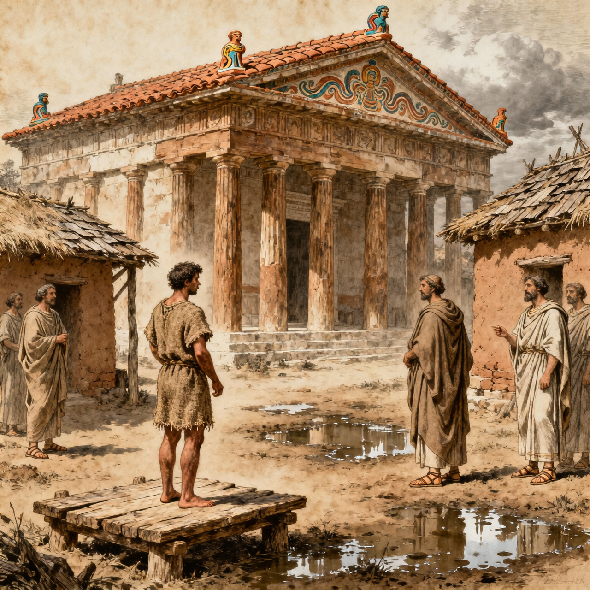
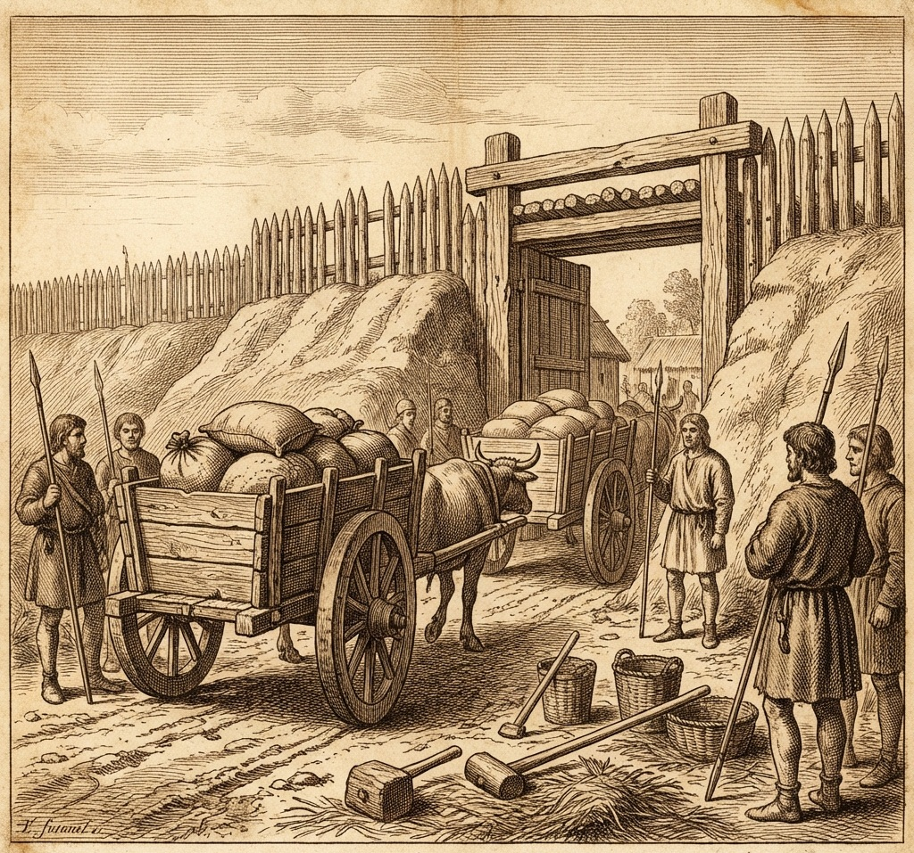

## 🔥 Темы недели

  

### Письма изгнанника найдены в доме патриция

Третьей ночью, до рассвета, раб по имени Лиг явился к дверям консулов с узлом в руках. В узле — восковые таблички, перевязанные шнуром с печатью. На печати — знак Тарквиниев.

По словам Лига, таблички были скрыты в сундуке под ложем младшего из сыновей консула Брута. Раб утверждает: видел, как гости приходили после заката. Лиц не разглядел — плащи с накинутым полотнищем. Но голоса узнал.

Сенат собрался на рассвете. Таблички вскрыты при ликторах. Содержание не разглашается — дело касается безопасности Республики. Но шёпот идёт по Форуму: письма адресованы свергнутому царю в Цере.

Сыновья консула Брута — Тит и Тиберий — взяты под стражу. Их видели у трибуны в полдень. Ликторы стояли по обе стороны. Ни один не поднял глаз на толпу.

Лиг отпущен на волю до решения сената. Его дом — теперь квартал ремесленников.

---

### Коллатин складывает полномочия

Вчера, после полудня, консул Луций Тарквиний Коллатин явился на Форум без ликторов. В руках держал знаки власти — фасции без топоров.

Речь была короткой. «Имя моё стало тенью на стене Республики. Тень не должна править светом».

Сенат не голосовал. Народ не кричал. Молчание длилось до заката.

Коллатин покинул Рим до вечерней зари. С ним ушли двое слуг, неся дорожный скарб. Дом на Палатине закрыт с той ночи, когда Лукрецию нашли с ножом в груди. Окна не открывают, очаг не разводят.

На месте консула — пустота. Выборы нового коллеги назначены на Иды мая.

---

## 💰 Новости рынка

  

### Зерно задерживается у речных ворот

Возы из Вейй стоят у речных ворот третий день. Стража проверяет каждый мешок. Ищут не колосья — письма.

Торговцы жалуются: зерно греется в мешках. Цена на фунт меди выросла на унцию за пять дней. Дворы под Эсквилином пекут лепёшки только до полудня — муки не хватает.

Один из возчиков, имя не названо, сказал писцам Вестника: «Раньше спрашивали, сколько везёшь. Теперь спрашивают, от кого везёшь».

Сенат обещал снять проверку после Ид. До тех пор — каждый воз под присмотром.

---

### Печи на Авентине не выпускают дым

Мастерские на Авентине не выпускают дым второй день. Глина есть, печь растоплена — но обжиг отложен.

Хозяин мастерской, имя скрыто, сообщил: «Заказы отменены. Кто боялся покупать амфоры из Цере, теперь боится покупать любые».

Три подмастерья отправлены по домам. Глина в корытах застыла.

---

## 🎭 Новости культуры и быта

  

### Очереди в низине под Эсквилином выросли вдвое

Женщины квартала у склона отмечают: вёдра опускают медленнее. Не из-за воды — из-за разговоров.

Одна из жительниц, имя скрыто, рассказала: «Вчера соседка спросила, чей сын пришёл ночью. Я ответила: «Не знаю». Она кивнула. Больше не спрашивала».

Кувшины стоят на земле. Вода в них мутнеет, пока хозяйки слушают.

---

### Жрецы принесли жертву перед сенатом

На рассвете, перед вскрытием писем, жрецы закололи ягнёнка у трибуны. Кровь собрали в глиняный сосуд.

Жрец-аугур, лицо не названо, сообщил писцам Вестника: «Внутренности чистые. Боги не гневаются на тех, кто ищет правду».

Ягнёнок был белым, без пятен. Это записали.

---

### Дети играют в «Суд над сыновьями»

На Форуме дети продолжают игру прошлой недели. Тогда называли «Царь и Изгнанник». Теперь — иначе.

Один мальчик стоит у камня. Другие кричат: «Признался?». Он молчит. Они бросают в него глиняные черепки.

---

## ⚠️ ЧП и происшествия

### Ночной стук в доме на Палатине

Соседи сообщают: в доме у подножия Палатина стучали после полуночи. Не в дверь — в ставни.

Утром ставни закрыты. Дым из трубы не шёл. Ликторы приходили на рассвете. Ушли через час.

Хозяин дома не выходил. Рабы выносили узлы к полудню. Куда — не видно.

---

### Раб найден без метки

У Тибрской пристани найден раб без метки. На шее — шнур, без таблички. Говорит: хозяин отпустил. На коже у шеи тускло видна старая метка от угля.

Стража взяла его до выяснения. Если хозяин не найдётся до Календ — станет свободным. Если найдётся — вернётся в кандалы.

Имя не записано.
