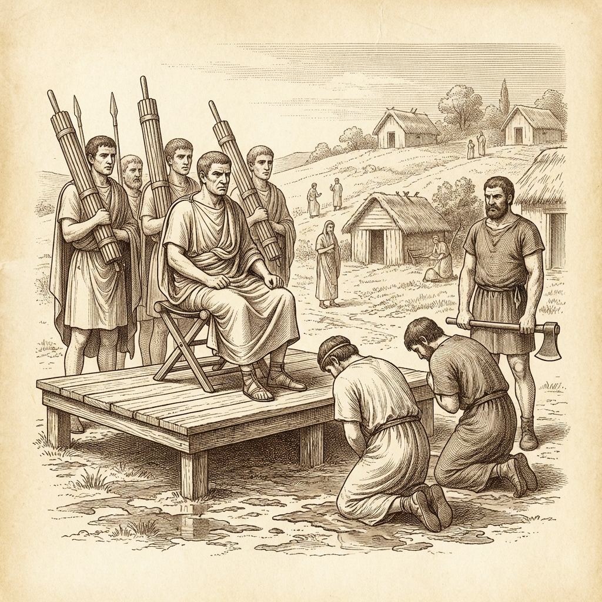
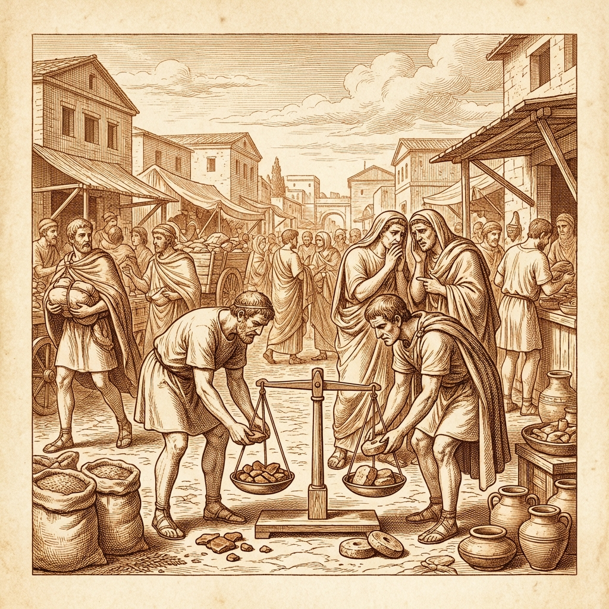
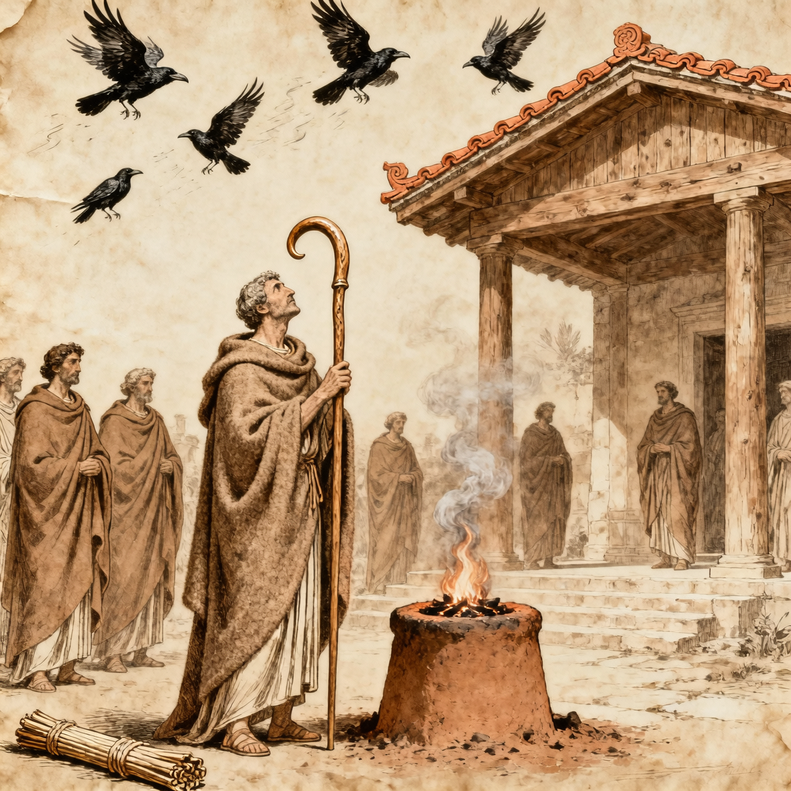

## 🔥 Темы недели

  

<!-- 
[STYLE]: Fine line antique copperplate engraving, warm sepia tones, light parchment background.
[PERIOD]: Archaic Rome, Etruscan style, 6th century BC.
[SUBJECT]: Public execution on a wooden platform at northern edge of muddy forum.
[DETAILS]: Lictors holding fasces WITHOUT axes (bundles of rods bound with leather straps). Consul Brutus standing stoically on a high wooden chair, looking forward, not at the condemned. Two young men kneeling. Sextator holding axe separately, not attached to fasces. Crowd in background in simple woolen tunics. Wooden temples with wide eaves in distance.
[NEGATIVE]: --no letters, --no text, --no labels, --no caption, --no signature, --no color, --no marble, --no columns, --no rostra, --no modern clothes, --no axes on fasces.
[SIZE]: --ar 16:9
-->

### ⚖️ Закон выше крови: приговор исполнен

**Вчера, у северного края Форума.**

Толпа собралась до рассвета. Места у помоста занимали те, кто пришёл ночью. Говорят, некоторые не спали вовсе.

**Утро.** Консул Луций Юний Брут занял место на деревянном стуле. Ликторы встали по бокам — фасции без лезвий, перевитые ремнями. По словам торговца рыбой с Тибра, консул смотрел прямо, не моргая. «Как будто перед ним пустое место».

**Третий час.** Зачитали имена. Тит и Тиберий, сыновья консула. Толпа зашумела. Женщина у переднего ряда закрыла лицо плащом.

**Полдень.** Младший, Тиберий, попросил воды. Ему не дали. По словам горшечника с Авентина, консул сжал кулаки на подлокотниках. «Костяшки побелели, но он не поднял глаз».

**После полудня.** Розги сменились секирой. Топор подан палачу (секстатору) отдельно, по команде. Ударов было два. Головы отрублены на глазах у сената и народа. Тела унесли за помост — куда, толпа не видела.

> «Я стоял в третьем ряду, — говорит ветеран, служивший ещё при царе. — Брут не отвернулся. Ни разу. Я такого не видывал».

> «Пусть боги судят его, — сказала прачка у колодца. — Я бы не смогла смотреть на своих детей так».

> «Закон есть закон, — ответил ей пекарь. — Но дети ли они были после того, как письма нашли?»

Консул покинул помост, не проронив ни слова. Ликторы шли впереди, опустив фасции.

### 🔓 Раб Лиг получает свободу

Тот, кто принёс письма заговорщиков, сегодня вышел на Форум не в цепях. По решению консула и сената, раб, именовавший себя Лиг, отпущен на волю. Ему велено вписаться в трибу и подавать голос на собраниях. В курульные кресла ему дороги нет.

Это первый случай в памяти живущих, когда раб становится отпущенником за донос на господ. Лиг стоит теперь у входа в курию, одетый в простую тунику без знаков рабства. Некоторые отворачиваются, когда он проходит. Другие кланяются ниже, чем сенаторам. Страх перед ним сильнее презрения.

### 🏛️ Валерий берёт слово

Пока Брут молчал, Публий Валерий выступил перед толпой. Он стоял на деревянном возвышении, без венков и украшений.

— Мы изгнали царей не для того, чтобы щадить измену, — сказал он. — Пусть каждый запомнит этот день. Кто с нами — тот римлянин. Кто против — тот враг.

Валерий предложил объявить имя Лига на Форуме и внести в трибу. Также он объявил, что дом Тарквиниев на Палатине будет сровнен с землёй, чтобы ни один камень не помнил их стоп. Народ одобрил криком. Валерий кланялся низко, каждый раз, когда толпа шумела.

---

## 💰 Новости рынка

  

### 🌾 Зерно дорожает на треть

Возчики с Тибра сообщают о задержках. Баржи из Остии стоят у ворот по два дня. Стража проверяет каждый мешок тщательнее обычного. Цена на немолотое зерно выросла. За меру ячменя теперь просят два куска бронзы весом в либру вместо полутора.

Пекари лепёшек говорят, что дрова тоже подорожали. Лесники с Яникула требуют плату за вход в лес заранее.

### 🧂 Соль и железо

Лавки у Соляной дороги работают до полудня. Соль покупают впрок. Железные наконечники копий исчезли с прилавков кузнецов. Мастера говорят, что весь металл идёт на заказ сената. Частным лицам предлагают только бронзу.

---

## 🎭 Новости культуры и быта

  

### 🐦 Вороны покинули Капитолий

Авгуры сообщают тревожный знак. Стая ворон, обычно гнездящаяся на склоне Капитолия, улетела на рассвете в сторону Вейй. Жертвенный козёл заблеял неестественным голосом перед ударом ножа. Жрецы советуют семьям не заключать браков в ближайшие иды.

### 🕯️ Женщины готовят траур

В квартале у склона Эсквилина женщины собирают тёмную шерсть. Говорят, сенат издаст указ об обязательном оплакивании консула, если он падёт в бою. Матери прячут детей дома после заката. У колодцев в низине меньше голосов.

---

## ⚠️ ЧП и происшествия

<!-- 
НАЗНАЧЕНИЕ РАЗДЕЛА: Инциденты (80% сюжета)
- Сюжетные триггеры и ложные следы.
- Структура: 1–2 заметки двигают сюжет + 1 заметка является ложной вилкой или бытовухой.
-->

### 🗡️ Драка в таверне «Три амфоры»

Вчера вечером у речных ворот четверо молодых патрициев схватились за ножи. Причина — спор о том, прав ли был Брут. Один кричал, что закон суровее отца. Другой плевал на землю и называл консула мясником.

Стража разняла дерущихся. Двоих оставили в карцере у подножия Капитолия до утра. Хозяин таверны заколотил окно, через которое вылетел стол.

### 🐐 Пропала коза у отпущенника

Лиг, новый отпущенник, сообщил страже о краже. У него пропала коза с привязи у дома. Стража нашла животное зарезанным у порога. Шкура брошена рядом. Никаких знаков на шкуре не обнаружено. Это предупреждение или просто голод? Стража ведёт дознание.
