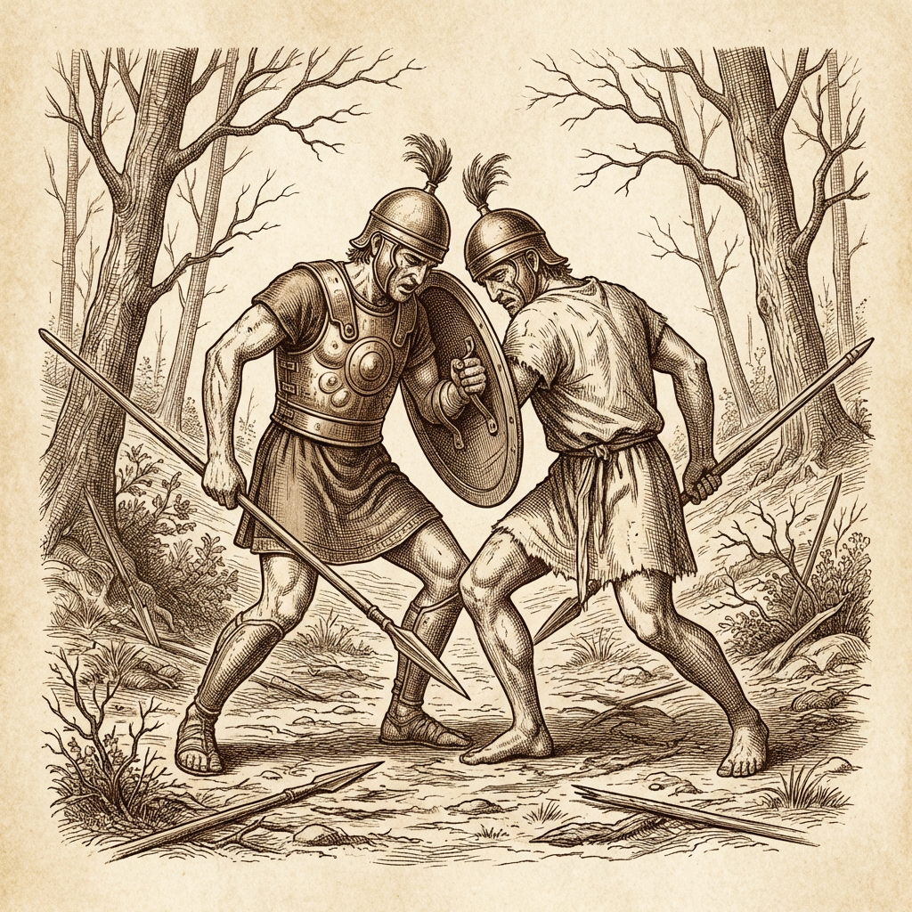
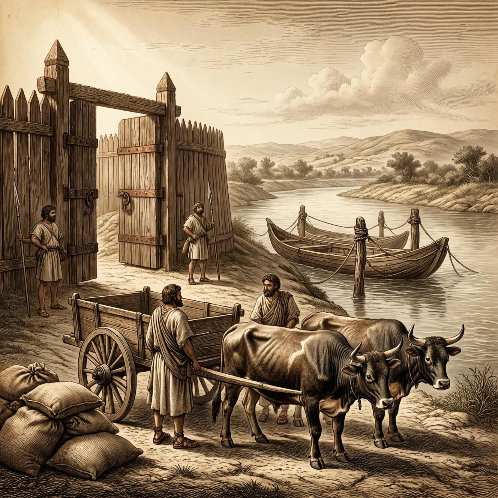
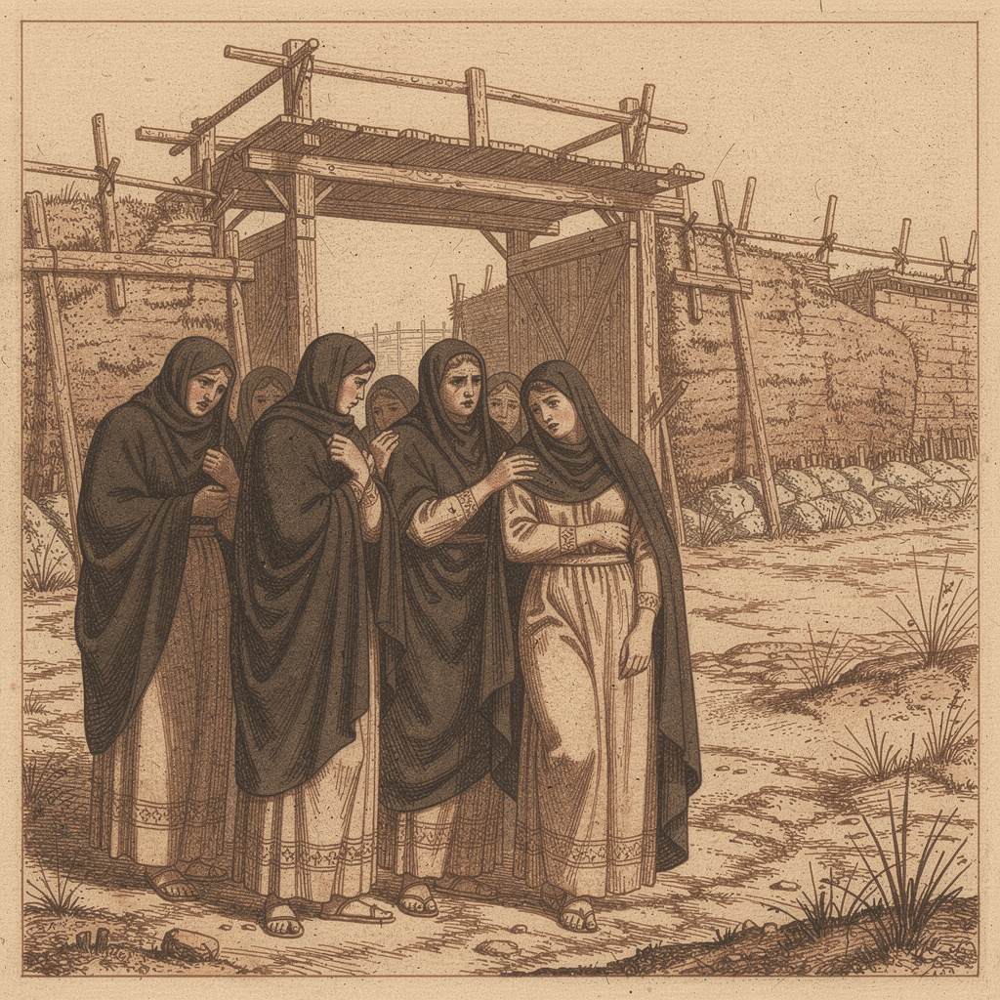

## 🔥 Темы недели

<!-- Главная новость - битва и гибель Брута -->

  

### Битва при Арсийском лесу: исход неизвестен до вечера

На третий день после майских Ид войско Тарквиниев было замечено у границы. Консул Брут вышел навстречу без промедления — так сказали гонцы, прискакавшие к полудню. Место схватки выбрали у Арсийского леса, где дорога на Вейи делает изгиб.

Первые вести принесли раненые к закату. Они говорили, что схватка была яростной, но римляне удержали поле. Тарквиний-отец отступил к Клузию. Однако среди тех, кто не вернулся — имя консула.

Гонец, доставивший щит Брута, не смог ответить на вопрос курии. Он лишь сказал: «Тело осталось там. Мы держали строй». Сенат собрался до ночи. Постановление ещё не оглашено.

### Аррунт Тарквиний пал в поединке

Из уст в уста передают: сын изгнанного царя, Аррунт, вызвал консула на единоборство. Оба удара достигли цели. Свидетели — трое из центурии Марка Валерия — подтверждают: они видели, как оба воина упали одновременно.

Один из них, копьеносец по имени Фавст, сказал у ворот: «Я держал поводья консула. Когда Аррунт пошёл вперёд, Брут не отступил. Копья встретились. Оба рухнули как подкошенные».

Второй, пехотинец из первой линии, добавил: «В пыли не разберёшь, кто кого пронзил. Упали вместе — и строй сомкнулся».

Третий, центурион Квинт Сервилий, сказал коротко: «Видел падение обоих. Враг отступил первым».
Тело Аррунта забрал его отец при отступлении. Останки консула — нет.

### Войско возвращается без консула

К вечеру четвёртого дня первые центурии вошли через Речные ворота. Лица уставшие, панцири в грязи. Многие несут чужие щиты — свои оставили павшим.

Старшинство в стане принял Марк Валерий Публикола. Он отдал приказ: не зажигать огней на стенах до особого распоряжения. Стража усилена у всех ворот. Ликторы сопровождают его без топоров — внутри померия.

---

## 💰 Новости рынка

  

### Зерновые ладьи задержаны под Фиденами

Три плоскодонные ладьи с немолотым зерном из Вейев стоят у берега ниже Фиден. Перевозчики ссылаются на «неясность пути» — на реке выставлена стража. Хозяин двора у Палатина, Секст Аврелий, сказал: «Цена поднимется к Календам. Кто имеет запасы — придержит».

Торговцы на подходе к Речным воротам требуют весовую бронзу вперёд. Некоторые разворачивают возы — не желают рисковать.

### Кузницы Авентина работают до ночи

Печи на Авентине не гаснут. Мастера перековывают наконечники копий, чинят панцири. Железа едва хватает — весь запас ушёл на вооружение ополчения.

Один из кузнецов, чьё имя не называют, сказал: «За три дня вышло больше, чем за месяц. Но платят бронзой, не обещают». Заказы от сената — прежде всего. Лавки с инструментами пустеют.

---

## 🎭 Новости культуры и быта

  

### Женщины у ворот ждут вестей

С рассвета у Речных ворот собрались женщины — жёны, матери, сёстры тех, кто ушёл с консулом. Некоторые стоят без движения, другие ходят вдоль стены. Плакальщицы уже начали причитания — по тем, чьи имена подтверждены.

Одна из них, вдова с Авентина, сказала: «Я не знаю, жив ли мой муж. Но я принесла тёмную шерсть — на всякий случай». Торговцы тканью отмечают спрос на тёмное полотно.

### Вороны над Капитолием молчат

Авгуры заметили: птицы, обычно гнездящиеся на священном участке, покинули место. Три дня подряд ни один ворон не был замечен над храмовым холмом. Старейшина жрецов сказал коротко: «Юпитер не говорит с нами сейчас».

Жертвоприношение, назначенное на Ноны, отложено до особого знака.

### Дети играют в «Брута и Тарквиния»

У колодца в низине под Эсквилином дети делятся на две группы. Одна кричит: «Мы за Республику!», другая: «Мы за царя!». Камни не летают — только крик.

Старик, проходящий мимо, сказал: «Я видел такую же игру сорок лет назад. Тогда тоже кричали. Потом пришла тишина».

---

## ⚠️ ЧП и происшествия

### Ночной пожар у склада соли

На вторую ночь после битвы загорелся навес у солевого двора у Речных ворот. Стража утверждает: поджог. Три мешка соли сгорело, ещё пять испорчено водой.

Хозяин двора, вольноотпущенник по имени Марк, сказал: «Я видел тень у стены. Но кто — не знаю». Идёт разбор. За подозрение схвачен перевозчик из Вейев — он отрицает.

### Драка в таверне «Три амфоры»

Трое вернувшихся воинов и двое местных — причина неясна. Один говорит: «Они сказали, что Брут сам напросился». Другой: «Мы просто пили». Хозяин таверны выставил всех до рассвета. Урон — две разбитые амфоры, стол расколот.

Стража увела зачинщиков. Имена не называются.

### Ложная весть о падении ворот

К полудню пронёсся слух: Тарквиний уже у стен, ворота открыты изнутри. Толпа у Форума начала расходиться. Оказалось: гонец перепутал направление — он говорил об отступлении врага, не о наступлении.

Публикола вышел к народу и сказал: «Ворота закрыты. Стража на местах». Толпа разошлась.

---

## 📜 Последняя весть перед закатом

Гонец от Публиколы объявил у курии: Публикола велел доставить тело консула Брута завтра на рассвете. Решено не оставлять его на поле. Отряд добровольцев вызвался вернуться.

Сенат постановил: год траура для женщин Рима. Лавки закроются в день похорон.

Брута называют среди павших за Республику. Имя Аррунта — в списках врагов.

Поле осталось за нами. Сенат назначил собрание на завтра.
