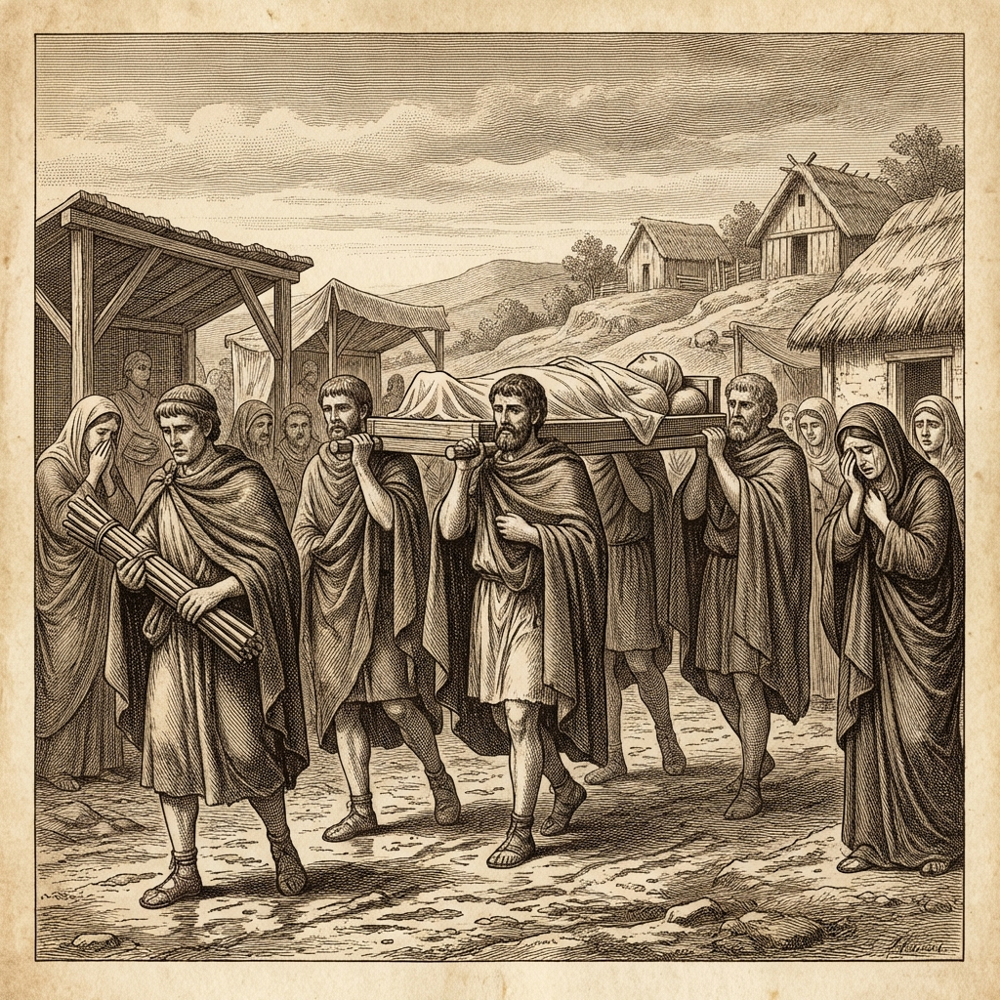
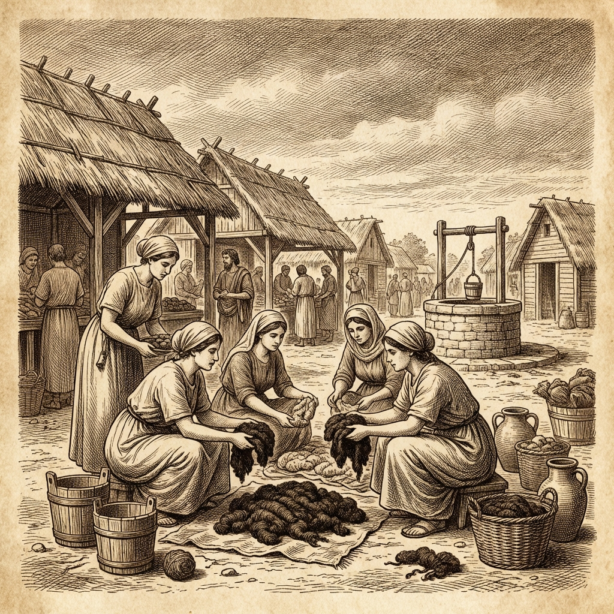
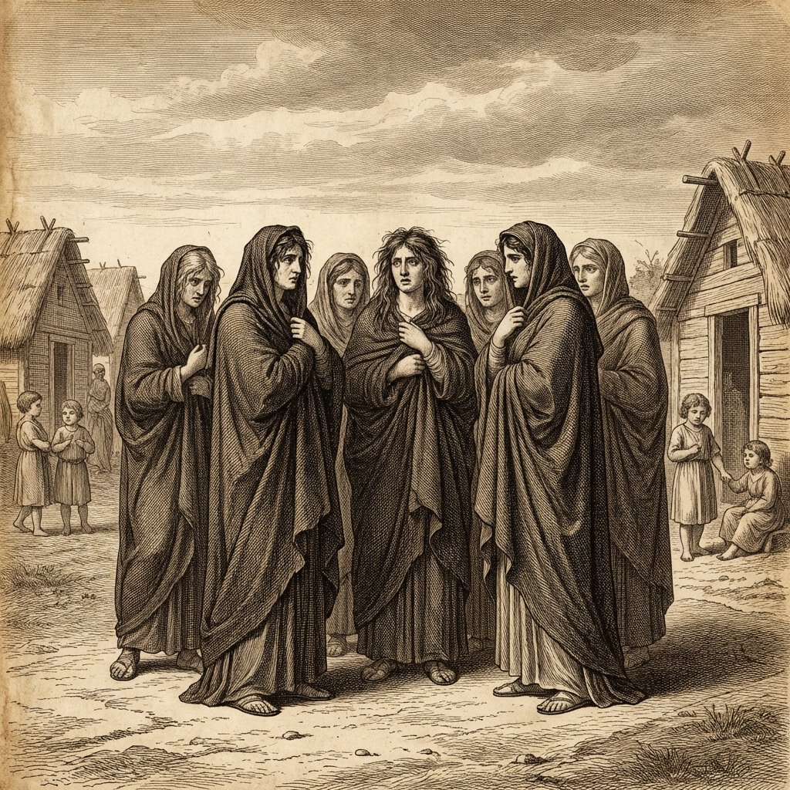

## 🔥 Темы недели

  

### Рим проводил Брута в последний путь

Третьего дня после Ид тело консула Луция Юния Брута было внесено через западные ворота. Процессия следовала от лагеря на Арсийской дороге до Северного края Форума. Носилки из некрашеного дерева несли шесть старших десятников из той центурии, где пал консул.

Публий Валерий, ныне именуемый Публиколой, шёл впереди с фасцами — топоры не были вставлены, по обычаю внутри померия. За носилками следовали женщины в тёмной шерсти, многие без покрывал, что редко бывает в дни траура. Плакальщицы били себя в грудь и бросали пыль на голову.

Тело не было сожжено — по решению сената, останки консула покоятся в гробнице у южного тракта, в месте, которое будет названо в его честь. Надпись на камне гласит лишь: «Здесь лежит тот, кто изгнал царей».

Сенат объявил: все женщины Рима носят траур по Бруту один год. Это первый случай, когда скорбь становится законом.

---

### Публикола принимает консульство

Пятого дня после Ид курия собралась без обычного жертвоприношения. Публий Валерий был назван консулом до новых выборов — единогласно; спорить не стали.

В своей речи он сказал: «Фасцы, которые я принимаю, несут ту же тяжесть, что и у Брута. Топоры останутся вне померия, пока я ношу тогу». Многие в курии кивнули. Это обещание запомнят.

Второго консула не будет до Календ Секстилия. До тех пор Публикола один несёт бремя консулата.

---

## 💰 Новости рынка

  

### Тёмная шерсть: цена выросла после декрета

У колодцев в Низине под Эсквилином женщины обменивались тёмной шерстью. После сенатского декрета о годовом трауре цена на крашеную ткань поднялась вдвое.

Торговец из Вей привёз партию шерсти, но просит пять кусков бронзы за локоть. Одна женщина сказала: «Я крашу белую шерсть соком ягод. Но цвет выходит не тот». Другие собирают деньги на покупку у торговца.

Ремесленники на Авентине говорят, что красильни работают до заката. Запасов ягод хватает ненадолго.

---

### Масло для ламп: спрос растёт

Торговцы маслом у ворот у реки говорят, что спрос на оливковое масло вырос. Семьи зажигают больше ламп — поминальные огни горят до рассвета.

Цена на масло поднялась на один кусок бронзы за меру. Один торговец сказал: «Люди боятся темноты. После битвы каждый хочет света в доме».

Амфоры из-под масла возвращают редко — хозяева оставляют их для хранения. Гончары на Авентине не успевают обжигать новые.

---

## 🎭 Новости культуры и быта

  

### Плакальщицы не справляются с заказами

Профессиональные плакальщицы работают с рассвета до заката. После похорон Брута семьи заказывают обряды для павших в Арсийском лесу.

Одна плакальщица сказала: «Я плачу по трём усопшим в день. Голос срывается». Другие берут учениц — девушек из бедных семей. Плата — кусок хлеба и тёмная шерсть.

Дети в играх теперь играют не в «Царя и Изгнанника», а в «Брута и Тарквиния». Правила те же, но имена другие.

---

### Ауспиции: вороны вернулись

Пятого дня после Ид жрецы-аугуры заметили: вороны, покинувшие Капитолий перед битвой, вернулись на священный участок. Это толкуют по-разному.

Старший аугур сказал лишь: «Юпитер молчит. Это не знак гнева, но и не знак милости». Жертва ягнёнка была принесена без обычных песен.

---

## ⚠️ Беды и происшествия

### Ночной шум у карцера

На вторую ночь после Ид стража у карцера слышала голоса изнутри. Один из задержанных заговорщиков пытался говорить с охраной.

Стражник сказал: «Он звал по имени. Мы не ответили». Утром доложили Публиколе. Консул приказал: «Никого не впускать. Без моего разрешения — ни слова».

Имён не назвали. Тела унесли до рассвета.

---

### Ограбление похоронного обоза

Вчера на дороге к южной гробнице трое мужчин остановили повозку с дарами для усопшего. Забрали три амфоры вина, кусок тёмной шерсти, медную чашу.

Стража у ворот у реки нашла следы колёс в грязи. След ведёт к Низине под Эсквилином. Хозяин повозки говорит, что убыток покроет сенат — дары были для Брута.

Никто не задержан.

---

### Слухи с севера: Ларс Порсена собирает войско

Третьего дня к воротам у реки подъехали два гонца из Фиден. Они принесли весть: Ларс Порсена, царь Клузия, собирает войско на северной границе.

Подробностей нет. Один из гонцов сказал: «Видел дымы от костров. Много костров». Другой молчал.

Сенат не комментирует. Публикола сказал лишь: «Рим помнит Арсий. Рим готов».

Стража у ворот усилена. Ликторы получили приказ: не пропускать чужих без печати сената.
