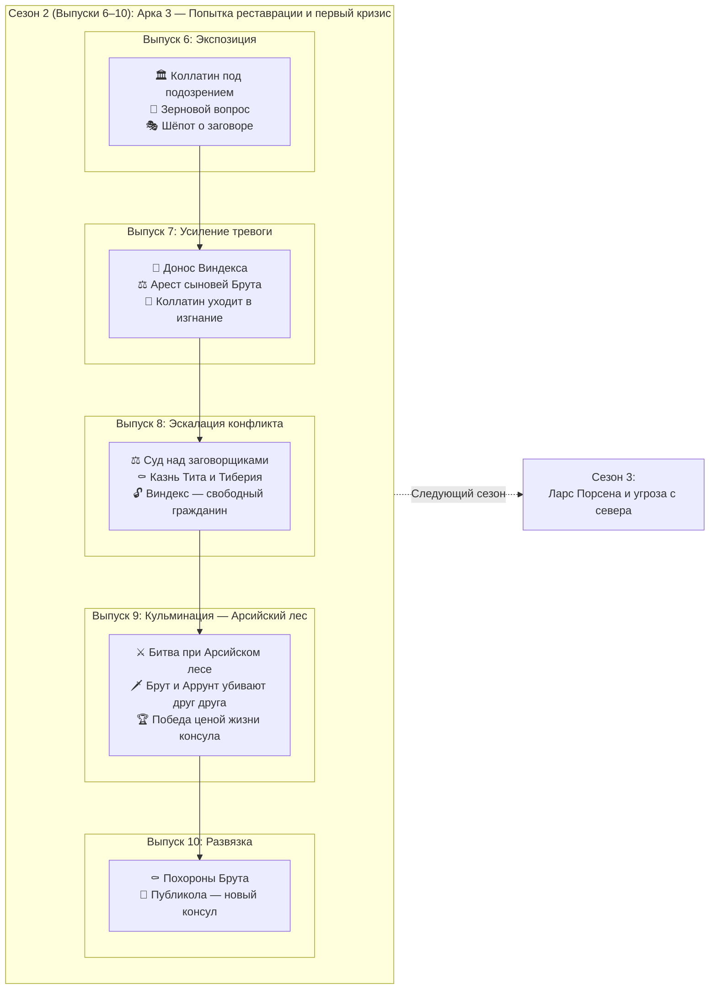

# 🏛️ Сценарий выпусков 6–10 — Изгнание царей и первый кризис Республики

**Период:** AUC 245–246 (ок. 509–508 до н.э.)  
**Эпоха:** Ранняя Республика, царское наследие и попытка реставрации  

> **Примечание:** Сезон 2 развивает Арку 3 (из общего плана) с логическим продолжением крючков, оставленных в конце Сезона 1. Сосредоточен на паранойе, предательстве и трагической развязке первого кризиса Республики.

---

## 📋 Обзор сезона

| Параметр | Значение |
|----------|----------|
| Количество выпусков | 5 (выпуски 6–10) |
| Ключевое событие(я) | Уход Коллатина в изгнание; раскрытие заговора и казнь сыновей Брута; битва при Арсийском лесе; гибель Брута |
| Основные персонажи | Луций Юний Брут (консул), Луций Тарквиний Коллатин (консул), Тит и Тиберий (сыновья Брута), Публикола (Валерий), Ларс Порсена (царь Клузия), раб Виндекс (доносчик), Аррунт Тарквиний (сын свергнутого царя) |
| География | Рим (Форум, Палатин, храмы), Арсийский лес, путь на Клузий |
| Связь с предыдущим сезоном | Прямое продолжение: консулы у власти, но имя «Тарквиний» преследует Коллатина; заговор зреет среди молодёжи |

---

## 🎯 Задачи сезона

1. **Исторические:**
   - Показать уход Коллатина в изгнание под давлением сената (имя «Тарквиний» невыносимо для народа)
   - Отразить заговор молодых аристократов и казнь сыновей Брута — ключевое испытание Республиканской добродетели
   - Показать битву при Арсийском лесе: гибель Брута и Аррунта Тарквиния в поединке
   - Ввести фигуру Публиколы (Валерия) как преемника

2. **Нарративные:**
   - Трагедия Брута: казнь собственных сыновей ради Республики
   - Паранойя города: имя «Тарквиний» вызывает страх; каждый подозрителен
   - От триумфа основания Республики к горечи первых жертв

3. **Стилистические:**
   - Газетный стиль с расширенными очерками о суде и битве
   - Полифония голосов: сенаторы, рабы-осведомители, жрецы, плакальщицы
   - Ощущение неизбежности: события несут героев к трагическому исходу

---

## 📰 Сценарий выпусков

### Выпуск 6 — Тень имени (Экспозиция)

**Задачи выпуска:**
- Установить новую норму: Республика живёт, но имя «Тарквиний» отравляет атмосферу.
- Показать давление на Коллатина: сенат и народ не доверяют ему.
- Первые слухи о молодых патрициях: шёпот, ночные встречи, странные визитёры.
- Зерновой вопрос: торговые пути под угрозой, Цере и Вейи настороже.

---

### Выпуск 7 — Раскрытие (Усиление тревоги)

**Задачи выпуска:**
- Донос раба Виндекса: заговор раскрыт, письма к Тарквиниям перехвачены.
- Арест сыновей Брута (Тита и Тиберия) и других молодых патрициев.
- Коллатин принимает решение: уйти в изгнание, чтобы не быть обузой Республике.
- Город в напряжении: суд грядёт, приговор предрешён, но какова будет цена?

---

### Выпуск 8 — Кровь ради Республики (Эскалация конфликта)

**Задачи выпуска:**
- Суд над заговорщиками: Брут председательствует, не отводит глаз.
- Казнь сыновей Брута на Форуме — публичная, ритуальная, без снисхождения.
- Реакция города: ужас, уважение, страх перед беспощадностью консулата.
- Виндекс получает свободу и гражданство — прецедент, который запомнят.
- Публикола (Валерий) выдвигается как будущий лидер.

---

### Выпуск 9 — Арсийский лес (Кульминация)

**Задачи выпуска:**
- Войско Тарквиниев подходит к границам: царь в изгнании ищет возвращения.
- Битва при Арсийском лесе: хаос, жестокость, неопределённый исход.
- Поединок: Брут и Аррунт Тарквиний убивают друг друга.
- Римляне одерживают победу, но цена — тело консула на поле боя.
- Весть достигает города: Брут погиб.

---

### Выпуск 10 — Плач по Бруту (Развязка и переход)

**Задачи выпуска:**
- Похороны Брута: плакальщицы, официальная скорбь, речи Публиколы.
- Публикола становится консулом: единоличная власть до новых выборов.
- Женщины Рима оплакивают Брута год — декрет сената.
- Город возвращается к жизни: страх утих, но тревога остаётся.
- Крючок для Сезона 3: слухи о Ларсе Порсене, царе Клузия — он готовит войско.

---

## 🔗 Блок-схема сезона

---

## 📝 Ключевые характеристики персонажей

| Персонаж | Роль | Эволюция в сезоне | Ключевые сцены |
|----------|------|-------------------|----------------|
| **Луций Юний Брут** | Консул, основатель Республики | От решимости к трагической гибели | Председательствует на суде сыновей; не отворачивается при казни; погибает в поединке с Аррунтом |
| **Луций Тарквиний Коллатин** | Консул, коллега Брута | От власти к изгнанию | Уходит добровольно, не желая быть источником раздора |
| **Тит и Тиберий (сыновья Брута)** | Заговорщики | От привилегий к эшафоту | Участвуют в переписке с Тарквиниями; казнены отцом на Форуме |
| **Публикола (Публий Валерий)** | Сенатор, будущий консул | От наблюдателя к лидеру | Поддерживает Брута; произносит надгробную речь; принимает консульство |
| **Раб Виндекс** | Доносчик | От рабства к свободе | Приносит перехваченные письма; получает свободу и гражданство |
| **Аррунт Тарквиний** | Сын свергнутого царя | Враг, погибает в бою | Сражается с Брутом; оба падают |
| **Ларс Порсена** | Царь Клузия (фигура в тени) | Готовит вторжение | Только слухи в конце сезона; реальная угроза — в будущем |

---

## Рецензия историка

### Рекомендуемые источники

1. **Тит Ливий**, «Ab Urbe Condita», книга II, главы 1–7 — основной нарратив
2. **Дионисий Галикарнасский**, «Римские древности», книга V — альтернативная версия деталей
3. **Плутарх**, жизнеописание Публиколы — подробности о казни и смерти Брута

### Рекомендации по усилению историчности

---

### Чек-лист анахронизмов

| Ошибка | Корректная замена |
|--------|-------------------|
| «Мобилизация войска» как современный термин | «Сбор ополчения», «войсковой набор», «поднятие легиона» |
| «Информаторы» | «Доносчики», «осведомители» |
| «Редакция» — слишком современно | «Составители», «писцы Вестника» |