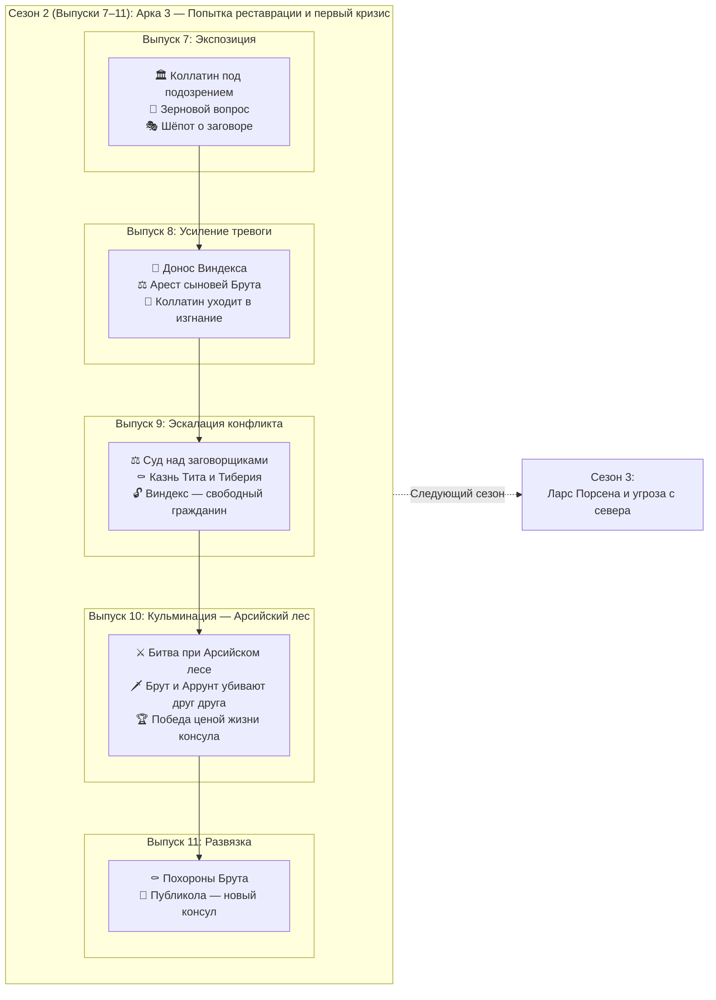

# 🏛️ Сценарий выпусков 7–11 — Изгнание царей и первый кризис Республики

**Период:** AUC 245–246 (ок. 509–508 до н.э.)  
**Эпоха:** Ранняя Республика, царское наследие и попытка реставрации  

> **Примечание:** Сезон 2 развивает Арку 3 (из общего плана) с логическим продолжением крючков, оставленных в конце Сезона 1. Сосредоточен на паранойе, предательстве и трагической развязке первого кризиса Республики.

---

## 📋 Обзор сезона

| Параметр | Значение |
|----------|----------|
| Количество выпусков | 5 (выпуски 7–11) |
| Ключевое событие(я) | Уход Коллатина в изгнание; раскрытие заговора и казнь сыновей Брута; битва при Арсийском лесе; гибель Брута |
| Основные персонажи | Луций Юний Брут (консул), Луций Тарквиний Коллатин (консул), Тит и Тиберий (сыновья Брута), Публикола (Валерий), Ларс Порсена (царь Клузия), раб Виндекс (доносчик), Аррунт Тарквиний (сын свергнутого царя) |
| География | Рим (Форум, Палатин, храмы), Арсийский лес, путь на Клузий |
| Связь с предыдущим сезоном | Прямое продолжение: консулы у власти, но имя «Тарквиний» преследует Коллатина; заговор зреет среди молодёжи |

---

## 🎯 Задачи сезона

1. **Исторические:**
   - Показать уход Коллатина в изгнание под давлением сената (имя «Тарквиний» невыносимо для народа)
   - Отразить заговор молодых аристократов и казнь сыновей Брута — ключевое испытание Республиканской добродетели
   - Показать битву при Арсийском лесе: гибель Брута и Аррунта Тарквиния в поединке
   - Ввести фигуру Публиколы (Валерия) как преемника

2. **Нарративные:**
   - Трагедия Брута: казнь собственных сыновей ради Республики
   - Паранойя города: имя «Тарквиний» вызывает страх; каждый подозрителен
   - От триумфа основания Республики к горечи первых жертв

3. **Стилистические:**
   - Газетный стиль с расширенными очерками о суде и битве
   - Полифония голосов: сенаторы, рабы-осведомители, жрецы, плакальщицы
   - Ощущение неизбежности: события несут героев к трагическому исходу

---

## 📰 Сценарий выпусков

### Выпуск 7 — Тень имени (Экспозиция)

**Задачи выпуска:**
- Установить новую норму: Республика живёт, но имя «Тарквиний» отравляет атмосферу.
- Показать давление на Коллатина: сенат и народ не доверяют ему.
- Первые слухи о молодых патрициях: шёпот, ночные встречи, странные визитёры.
- Зерновой вопрос: торговые пути под угрозой, Цере и Вейи настороже.

**Использованные в выпуске мотивы:**
- Ауспиции: вороны покинули священный участок
- Термин: пропавший камень на границе
- Детская игра: «Царь и Изгнанник»
- Таверна: «Три амфоры» — драка из-за слухов

---

### Выпуск 8 — Раскрытие (Усиление тревоги)

**Задачи выпуска:**
- Донос раба Лига: заговор раскрыт, письма к Тарквиниям перехвачены.
- Арест сыновей Брута (Тита и Тиберия) и других молодых патрициев.
- Коллатин принимает решение: уйти в изгнание, чтобы не быть обузой Республике.
- Город в напряжении: суд грядёт, приговор предрешён, но какова будет цена?

**Использованные в выпуске мотивы:**
- Ауспиции: Жертва ягнёнка
- Детская игра: «Суд над сыновьями»
- Колодец: Очереди (низина)
- Ремесло: Печи на Авентине
- Рабы/Вольноотпущенники: Лиг (без метки)
- Топонимика: Низина под Эсквилином, речные ворота, Авентин

---

### Выпуск 9 — Кровь ради Республики (Эскалация конфликта)

**Задачи выпуска:**
- Суд над заговорщиками: Брут председательствует, не отводит глаз.
- Казнь сыновей Брута на Форуме — публичная, ритуальная, без снисхождения.
- Реакция города: ужас, уважение, страх перед беспощадностью консулата.
- Виндекс получает свободу и гражданство — прецедент, который запомнят.
- Публикола (Валерий) выдвигается как будущий лидер.

---

### Выпуск 10 — Арсийский лес (Кульминация)

**Задачи выпуска:**
- Войско Тарквиниев подходит к границам: царь в изгнании ищет возвращения.
- Битва при Арсийском лесе: хаос, жестокость, неопределённый исход.
- Поединок: Брут и Аррунт Тарквиний убивают друг друга.
- Римляне одерживают победу, но цена — тело консула на поле боя.
- Весть достигает города: Брут погиб.

---

### Выпуск 11 — Плач по Бруту (Развязка и переход)

**Задачи выпуска:**
- Похороны Брута: плакальщицы, официальная скорбь, речи Публиколы.
- Публикола становится консулом: единоличная власть до новых выборов.
- Женщины Рима оплакивают Брута год — декрет сената.
- Город возвращается к жизни: страх утих, но тревога остаётся.
- Крючок для Сезона 3: слухи о Ларсе Порсене, царе Клузия — он готовит войско.

---

## 🔗 Блок-схема сезона

---

## 📝 Ключевые характеристики персонажей

| Персонаж | Роль | Эволюция в сезоне | Ключевые сцены |
|----------|------|-------------------|----------------|
| **Луций Юний Брут** | Консул, основатель Республики | От решимости к трагической гибели | Председательствует на суде сыновей; не отворачивается при казни; погибает в поединке с Аррунтом |
| **Луций Тарквиний Коллатин** | Консул, коллега Брута | От власти к изгнанию | Уходит добровольно, не желая быть источником раздора |
| **Тит и Тиберий (сыновья Брута)** | Заговорщики | От привилегий к эшафоту | Участвуют в переписке с Тарквиниями; казнены отцом на Форуме |
| **Публикола (Публий Валерий)** | Сенатор, будущий консул | От наблюдателя к лидеру | Поддерживает Брута; произносит надгробную речь; принимает консульство |
| **Раб Виндекс** | Доносчик | От рабства к свободе | Приносит перехваченные письма; получает свободу и гражданство |
| **Аррунт Тарквиний** | Сын свергнутого царя | Враг, погибает в бою | Сражается с Брутом; оба падают |
| **Ларс Порсена** | Царь Клузия (фигура в тени) | Готовит вторжение | Только слухи в конце сезона; реальная угроза — в будущем |

---

## Рецензия историка

### Рекомендуемые источники

1. **Тит Ливий**, «Ab Urbe Condita», книга II, главы 1–7 — основной нарратив
2. **Дионисий Галикарнасский**, «Римские древности», книга V — альтернативная версия деталей
3. **Плутарх**, жизнеописание Публиколы — подробности о казни и смерти Брута

### Рекомендации по усилению историчности

1. **Валюта и торговля:**
- **Избегать**: «ассы», «монеты», «ценники».
- **Торговля**: Допустимо использовать «соляные возы», «возчиков с Тибра», «лавки» как tabernae. Зерно обычно покупали немолотым и мололи дома. «Хлебные лавки» — редко, лучше: «дворы, где пекут лепёшки» или «торговцы зерном».
2. **Топонимика и архитектура:**
- **Избегать**:  «Ростра» (появится позже, после морских побед); «Субурра» (заселяется и получает название позже, при Республике это малообжитая низина); «Портенская застава» (Porta Portensis — III в. н.э.).
- **Термин**: Бог-покровитель границ Термин в эту эпоху — неоформленный камень-столб (cippus), а не статуя.
3. **Администрация и закон:**
- **Избегать**: «полиция», «префект» (в современном смысле), «патруль».
- **Ликторы и фасции**: Внутри померия фасции несли без топоров (axes) — символ ограничения власти магистрата в городе. Топоры вставлялись только за пределами священной границы или при исполнении приговора. При описании казни: топоры выдаются секстатору отдельно, по команде.
1. **Религиозные маркеры:**
- **Избегать**: Гуси как спасители Рима (анахронизм нападения галлов).
1. **Хронология:**
- **Избегать**: Названия дней недели («вторник»).
1. **Одежда и социальные маркеры:**
- **Избегать**: «Капюшон» (cucullus — термин более поздний, для VI в. до н.э. нет точных свидетельств).
- **Рабы**: клеймо. Для VI в. до н.э. практика брендирования рабов достоверно не засвидетельствована.
1. **Имена и ономастика:**
- **Избегать**: Имена с характерной поздней латинской морфологией (например, «Виндекс» — распространено в имперскую эпоху).
1. **Правовой статус отпущенников:**
- **Важно**: Вольноотпущенник (libertus) получал гражданство с ограничениями: право голоса в трибах, но без права занимать магистратуры.

---

## Чек-лист анахронизмов

| Ошибка | Корректная замена |
|--------|-------------------|
| «Мобилизация войска» как современный термин | «Сбор ополчения», «войсковой набор», «поднятие легиона» |
| «Информаторы» | «Доносчики», «осведомители» |
| «Редакция» — слишком современно | «Составители», «писцы Вестника» |
| Асс (как монета) | Весовая бронза (фунт, унция) |
| Ростра (трибуна с носами) | Трибуна / Помост |
| Цифры / Счета | Знаки счета / Палочное письмо |
| Полицейский патруль | Стража / Ликторы |
| Статуя бога Термина | Камень-столб (ciuрpus) |
| Дни недели (пон-воск) | Календы, Ноны, Иды |
| Газетная «лавка»/«редакция» | Таберна / Составители / Писцы |
| Гуси-хранители | Вороны-аугуры |
| «Субурра» | Низина под Эсквилином / Квартал у склона |
| «Портенская застава» | Ворота у тракта к Портуну / Речные ворота |
| «Гончарный холм» | Печи на Авентине / Гончарные мастерские |
| «Хлебные лавки» | Дворы с лепёшками / Торговцы зерном |
| «Капюшон» | Плащ с накинутым полотнищем |
| «Клеймо раба» (как штамп) | Метка углём / Шрам / Без метки |
| «Виндекс» (имя раба) | Серв, Лиг, Фауст, простое прозвище |
| «Темница» | Карцер / Под стражей |
| «Ликторы с топорами» (в городе) | Фасции без топоров / Топор подан отдельно |
| «Полное гражданство» (для вольноотпущенника) | Гражданские права отпущенника / Свобода с правом голоса |

---

## Правила историчности для иллюстраций:

1. **ЭПОХА И СТИЛЬ:**
- Использовать тег `Archaic Rome` или `Etruscan style` вместо простого `Roman`. Модель ассоциирует `Roman` с Империей (I-II вв. н.э.), что приводит к анахронизмам.
- Избегать терминов, вызывающих ассоциации с классической Грецией (прямые колонны, мрамор).
2. **АРХИТЕКТУРА (КРИТИЧЕСКИ ВАЖНО):**
- **Храмы**: Только этрусский тип («Tuscan order»). Широкие свесы крыши, деревянные колонны (толстые, без каннелюр), яркая терракотовая облицовка.
- **Акротерии**: На коньке крыши — статуи богов/воинов из крашеной терракоты, а не мраморные скульптуры во фронтонах (это более поздняя греческая традиция).
- **Форум**: Грязная площадь с лужами, деревянные помосты, торговые палатки. Нет мощёных улиц, нет мраморных портиков.
- **Жилая застройка**: «Capanne» (хижины из плетня, обмазанного глиной), соломенные или черепичные крыши.
- **Городские стены**: Для ранней Республики — деревянный палисад или сырцовые блоки. Избегать каменных стен с зубцами (battlements) — это поздняя визуализация.
3. **ОДЕЖДА**:
- **Тоги**: Использовать `toga exigua` или `simple woolen cloak` (тебенна). Драпировка должна выглядеть грубой и короткой, а не парадно-объёмной.
- **Туники**: Короткие, до колен (`knee-length`). Бедра прикрыты.
- **Обувь**: Босые ноги или простые сандалии (`simple sandals`). У элиты — *calcei repandi* (сандалии с загнутым носком). Никаких закрытых сапог.
- **Цвета**: для сенаторов/магистратов — тога с пурпурной каймой (`toga praetexta`), но без золотых вышивок.
4. **МАТЕРИАЛЫ**:
- Дерево, сырцовый кирпич, терракота (глина), грубый камень.
- Запрет на: мрамор, полированное стекло, сложные металлические конструкции.
5. **ТЕКСТ**:
- Категорический запрет на любые буквы или имитацию знаков (блок [NEGATIVE])

---

## 🎨 Технические рекомендации для генерации

### Проблемные триггеры и их решения:

| Проблема | Причина | Решение |
|----------|---------|---------|
| **Фасции с топорами** | Модель обучена на имперских изображениях, где fasces всегда с топором | Избегать слова «fasces». Использовать: `bundles of wooden rods tied with leather straps, blunt at the top`. Добавить в [NEGATIVE]: `--no axes on fasces, --no blades attached to rods` |
| **Шлемы не той эпохи** | «Roman helmet» = Montefortino (III в. до н.э.) или имперский стиль | Либо указывать `Etrusco-Italic bronze bowl helmet, simple rounded shape`, либо избегать шлемов вообще (ликторы в городе — в туниках). |
| **Мраморный Рим вместо деревянного** | Модель знает Колизей и Форум Августа | Ограничивать фон: `rural village vibe, thatched huts, wooden stalls`. В [NEGATIVE]: `--no temples, --no columns, --no marble, --no stone walls`. |
| **Слишком много храмов** | Модель заполняет пустоту «римскими» зданиями | Явно указывать: `simple background, open space, grassy slope`. |

### Рекомендации по упрощению промптов:

1. **Не перегружать деталями.** Для сложных сцен (казнь, битва) лучше указать 3–4 ключевых элемента, чем 10–12 исторических уточнений. Модель «теряется» и начинает галлюцинировать.

2. **Описывать через отрицание.** Для ранней Республики блок [NEGATIVE] важнее, чем [DETAILS]. Перечисляйте всё, чего НЕ должно быть: мрамор, колонны, храмы, шлемы с гребнями, топоры на фасциях, каменные стены.

3. **Фон — минимальный.** Лучше «грязная площадь и холм», чем «Форум с храмами». Детали архитектуры модель всё равно нарисует неверно.
