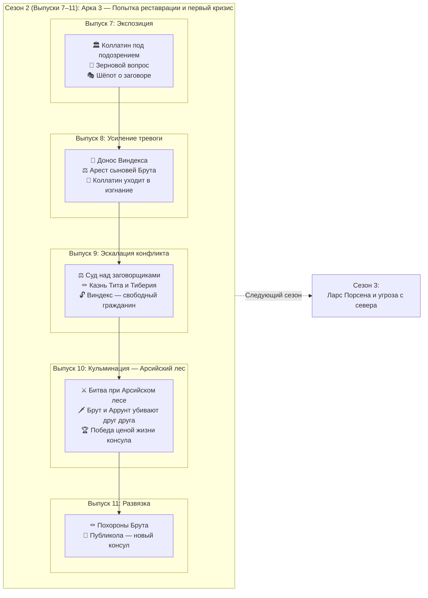

# 🏛️ Сценарий выпусков 7–11 — Изгнание царей и первый кризис Республики

**Период:** AUC 245–246 (ок. 509–508 до н.э.)  
**Эпоха:** Ранняя Республика, царское наследие и попытка реставрации  

> **Примечание:** Сезон 2 развивает Арку 3 (из общего плана) с логическим продолжением крючков, оставленных в конце Сезона 1. Сосредоточен на паранойе, предательстве и трагической развязке первого кризиса Республики.

---

## 📋 Обзор сезона

| Параметр | Значение |
|----------|----------|
| Количество выпусков | 5 (выпуски 7–11) |
| Ключевое событие(я) | Уход Коллатина в изгнание; раскрытие заговора и казнь сыновей Брута; битва при Арсийском лесе; гибель Брута |
| Основные персонажи | Луций Юний Брут (консул), Луций Тарквиний Коллатин (консул), Тит и Тиберий (сыновья Брута), Публикола (Валерий), Ларс Порсена (царь Клузия), раб Виндекс (доносчик), Аррунт Тарквиний (сын свергнутого царя) |
| География | Рим (Форум, Палатин, храмы), Арсийский лес, путь на Клузий |
| Связь с предыдущим сезоном | Прямое продолжение: консулы у власти, но имя «Тарквиний» преследует Коллатина; заговор зреет среди молодёжи |

---

## 🎯 Задачи сезона

1. **Исторические:**
   - Показать уход Коллатина в изгнание под давлением сената (имя «Тарквиний» невыносимо для народа)
   - Отразить заговор молодых аристократов и казнь сыновей Брута — ключевое испытание Республиканской добродетели
   - Показать битву при Арсийском лесе: гибель Брута и Аррунта Тарквиния в поединке
   - Ввести фигуру Публиколы (Валерия) как преемника

2. **Нарративные:**
   - Трагедия Брута: казнь собственных сыновей ради Республики
   - Паранойя города: имя «Тарквиний» вызывает страх; каждый подозрителен
   - От триумфа основания Республики к горечи первых жертв

3. **Стилистические:**
   - Газетный стиль с расширенными очерками о суде и битве
   - Полифония голосов: сенаторы, рабы-осведомители, жрецы, плакальщицы
   - Ощущение неизбежности: события несут героев к трагическому исходу

---

## 📰 Сценарий выпусков

### Выпуск 7 — Тень имени (Экспозиция)

**Задачи выпуска:**
- Установить новую норму: Республика живёт, но имя «Тарквиний» отравляет атмосферу.
- Показать давление на Коллатина: сенат и народ не доверяют ему.
- Первые слухи о молодых патрициях: шёпот, ночные встречи, странные визитёры.
- Зерновой вопрос: торговые пути под угрозой, Цере и Вейи настороже.

**Использованные в выпуске мотивы:**
- Ауспиции: вороны покинули священный участок
- Термин: пропавший камень на границе
- Детская игра: «Царь и Изгнанник»
- Таверна: «Три амфоры» — драка из-за слухов

---

### Выпуск 8 — Раскрытие (Усиление тревоги)

**Задачи выпуска:**
- Донос раба Лига: заговор раскрыт, письма к Тарквиниям перехвачены.
- Арест сыновей Брута (Тита и Тиберия) и других молодых патрициев.
- Коллатин принимает решение: уйти в изгнание, чтобы не быть обузой Республике.
- Город в напряжении: суд грядёт, приговор предрешён, но какова будет цена?

**Использованные в выпуске мотивы:**
- Ауспиции: Жертва ягнёнка
- Детская игра: «Суд над сыновьями»
- Колодец: Очереди (низина)
- Ремесло: Печи на Авентине
- Рабы/Вольноотпущенники: Лиг (без метки)
- Топонимика: Низина под Эсквилином, речные ворота, Авентин

---

### Выпуск 9 — Кровь ради Республики (Эскалация конфликта)

**Задачи выпуска:**
- Суд над заговорщиками: Брут председательствует, не отводит глаз.
- Казнь сыновей Брута на Форуме — публичная, ритуальная, без снисхождения.
- Реакция города: ужас, уважение, страх перед беспощадностью консулата.
- Лиг (бывший раб) получает свободу и гражданство — прецедент, который запомнят.
- Публикола (Валерий) выдвигается как будущий лидер.

**Использованные в выпуске мотивы:**
- **Ауспиции:** Вороны покинули Капитолий (дурное предзнаменование).
- **Ритуал:** Казнь как акт государственной воли (фасции без топоров, секира секстатора).
- **Социальный переход:** Освобождение раба (Лиг становится гражданином, вызывая социальное напряжение).
- **Рынок/Таверна:** «Три амфоры» (драки из-за споров о легитимности власти), дефицит железа (переориентация производства на нужды сената).
- **Быт:** Подготовка траурной одежды (женщины собирают тёмную шерсть), зерновой кризис (задержки барж).
- **Топонимика:** Северный край Форума, карцер у подножия Капитолия, курия.

---

### Выпуск 10 — Арсийский лес (Кульминация)

**Задачи выпуска:**
- Войско Тарквиниев подходит к границам: царь в изгнании ищет возвращения.
- Битва при Арсийском лесе: хаос, жестокость, неопределённый исход.
- Поединок: Брут и Аррунт Тарквиний убивают друг друга.
- Римляне одерживают победу, но цена — тело консула на поле боя.
- Весть достигает города: Брут погиб.

**Использованные в выпуске мотивы:**
- **Битва:** Арсийский лес, поединок Брута и Аррунта, свидетели из центурии Марка Валерия
- **Ауспиции:** Вороны покинули Капитолий — Юпитер молчит
- **Рынок:** Зерновые ладьи задержаны под Фиденами; кузницы Авентина работают до ночи (наконечники, панцири)
- **Быт:** Женщины у ворот ждут вестей; дети играют в «Брута и Тарквиния»
- **Таверна:** «Три амфоры» — драка из-за слов о Бруте
- **ЧП:** Пожар у солевого двора, ложная весть о падении ворот
- **Топонимика:** Арсийский лес, Речные ворота, Авентин, Капитолий, Эсквилин, Палатин, Фидены, Клузий

---

### Выпуск 11 — Плач по Бруту (Развязка и переход)

**Задачи выпуска:**
- Похороны Брута: плакальщицы, официальная скорбь, речи Публиколы.
- Публикола становится консулом: единоличная власть до новых выборов.
- Женщины Рима оплакивают Брута год — декрет сената.
- Город возвращается к жизни: страх утих, но тревога остаётся.
- Крючок для Сезона 3: слухи о Ларсе Порсене, царе Клузия — он готовит войско.

**Использованные в выпуске мотивы:**
- **Ритуал:** Похоронная процессия через западные ворота; фасцы без топоров внутри померия; гробница у южного тракта
- **Ауспиции:** Вороны вернулись на Капитолий — Юпитер молчит (не знак гнева, но и не милости)
- **Рынок:** Тёмная шерсть — цена вдвое выше после декрета о трауре; масло для ламп — спрос вырос, поминальные огни горят до рассвета
- **Быт:** Плакальщицы не справляются с заказами; дети играют в «Брута и Тарквиния» (правила те же, имена другие)
- **ЧП:** Ночной шум у карцера (задержанный заговорщик); ограбление похоронного обоза на южной дороге
- **Крючок:** Слухи с севера — Ларс Порсена собирает войско; гонцы из Фиден видели дымы от костров
- **Топонимика:** Арсийская дорога, Северный край Форума, Авентин, Низина под Эсквилином, Фидены, Клузий, ворота у реки, южный тракт

---

## 🔗 Блок-схема сезона

---

## 📝 Ключевые характеристики персонажей

| Персонаж | Роль | Эволюция в сезоне | Ключевые сцены |
|----------|------|-------------------|----------------|
| **Луций Юний Брут** | Консул, основатель Республики | От решимости к трагической гибели | Председательствует на суде сыновей; не отворачивается при казни; погибает в поединке с Аррунтом |
| **Луций Тарквиний Коллатин** | Консул, коллега Брута | От власти к изгнанию | Уходит добровольно, не желая быть источником раздора |
| **Тит и Тиберий (сыновья Брута)** | Заговорщики | От привилегий к эшафоту | Участвуют в переписке с Тарквиниями; казнены отцом на Форуме |
| **Публикола (Публий Валерий)** | Сенатор, будущий консул | От наблюдателя к лидеру | Поддерживает Брута; произносит надгробную речь; принимает консульство |
| **Раб Виндекс** | Доносчик | От рабства к свободе | Приносит перехваченные письма; получает свободу и гражданство |
| **Аррунт Тарквиний** | Сын свергнутого царя | Враг, погибает в бою | Сражается с Брутом; оба падают |
| **Ларс Порсена** | Царь Клузия (фигура в тени) | Готовит вторжение | Только слухи в конце сезона; реальная угроза — в будущем |

---

## Рецензия историка

> **NOTE:**
> 1. **Исторические примечания** — содержат только пояснения, контекст и обоснование. Сюда нельзя вносить правила замены текста.
> 2. **Глоссарий терминов** — содержит таблицу рекомендуемых замен для анахронизмов и стилистических ошибок

### Рекомендуемые источники

1. **Тит Ливий**, «Ab Urbe Condita», книга II, главы 1–7 — основной нарратив
2. **Дионисий Галикарнасский**, «Римские древности», книга V — альтернативная версия деталей
3. **Плутарх**, жизнеописание Публиколы — подробности о казни и смерти Брута

### Исторические примечания

1. **Валюта и торговля:**
   - Допустимо: «соляные возы», «возчики с Тибра», «лавки» (tabernae).
   - Зерно покупали немолотым и мололи дома. Торговцы зерном — не «хлебные лавки», а «дворы, где пекут лепёшки».
   - В 509 г. до н.э. обращались слитки необработанной бронзы (aes rude). Стандартизированная весовая система с фунтом и унцией появится только ок. 280 г. до н.э. с введением литого асса.

2. **Топонимика и архитектура:**
   - «Ростра» появятся позже, после морских побед.
   - «Субурра» заселяется и получает название позже — это пока малообжитая низина.
   - Porta Flumentana построена в составе стены Сервия (нач. IV в. до н.э.).
   - Via Appia проложена в 312 г. до н.э. Аппием Клавдием Цеком.
   - Термин (бог-покровитель границ) — неоформленный камень-столб (cippus), а не статуя.

3. **Администрация и закон:**
   - «Полиция», «префект» (в современном смысле), «патруль» — анахронизм.
   - **Ликторы и фасции:** внутри померия фасции несли без топоров — символ ограничения власти магистрата в городе. Топоры вставлялись только за пределами священной границы или при исполнении приговора. При описании казни: топоры выдаются секстатору отдельно, по команде.

4. **Религиозные маркеры:**
   - Гуси как спасители Рима — анахронизм (связаны с нашествием галлов, а не с событиями этого периода).

5. **Хронологию:**
   - Названия дней недели («понедельник», «вторник») — анахронизм. Пользоваться: Календы, Ноны, Иды.
   - Формулы дат: «после майских Ид», а не калькированное «после Ид вторых майских».

6. **Одежда и социальные маркеры:**
   - «Капюшон» (cucullus) — термин более поздний, для VI в. до н.э. нет точных свидетельств. Допустимо: «плащ с накинутым полотнищем».
   - Клеймо (брендирование) рабов для VI в. до н.э. достоверно не засвидетельствовано.

7. **Имена и ономастика:**
   - Имена с характерной поздней латинской морфологией (например, «Виндекс») — типичны для имперской эпохи.

8. **Правовой статус отпущенников:**
   - Вольноотпущенник (libertus) получал гражданство с ограничениями: право голоса в трибах, но без права занимать магистратуры.

### Глоссарий терминов

| Избегать | Корректная замена |
|----------|-------------------|
| Асс, монета, ценник | Весовая бронза (фунт, унция) |
| Баржа, баржи | Плоскодонная ладья, грузовая ладья, судно с Тибра |
| Дефицит, нехватка товара | «Не хватает», «едва хватает», «запасов мало» |
| Доспехи | Панцирь, бронзовый панцирь, защитное вооружение |
| Расследование (юридический термин) | Разбор, дознание, судебное рассмотрение |
| Информаторы | Доносчики, осведомители |
| Полицейский патруль | Стража, ликторы |
| Ростра (трибуна с носами кораблей) | Трибуна, помост |
| Цифры, счета | Знаки счёта, палочное письмо |
| Статуя бога Термина | Камень-столб (cippus) |
| Дни недели (пон-воск) | Календы, Ноны, Иды |
| «Редакция» (газеты) | Составители, писцы Вестника |
| Гуси-хранители | Вороны-аугуры |
| «Субурра» | Низина под Эсквилином, квартал у склона |
| «Портенская застава» | Ворота у тракта к Портуну, Речные ворота |
| «Гончарный холм» | Печи на Авентине, гончарные мастерские |
| «Хлебные лавки» | Дворы с лепёшками, торговцы зерном |
| «Капюшон» | Плащ с накинутым полотнищем |
| «Клеймо раба» (штамповка) | Метка углём, шрам, без метки |
| «Виндекс» (имя раба) | Серв, Лиг, Фауст, простое прозвище |
| «Темница» | Карцер, под стражей |
| «Ликторы с топорами» (в городе) | Фасции без топоров, топор подан отдельно |
| «Полное гражданство» (для вольноотпущенника) | Гражданские права отпущенника, свобода с правом голоса |
| «Мобилизация войска» | Сбор ополчения, войсковой набор, поднятие легиона |
| Формулы дат с калькой | «После майских Ид», «третий день после Ид» |
| «Фасции» | Фасцы (fasces), связки розг |
| «Фунт бронзы», «унция бронзы» | Кусок бронзы, слиток, необработанная бронза |
| «Центурион» (как офицер) | Старший десятник, декурион |
| «Аппиева дорога», «Via Appia» | Южный тракт, дорога на юг |
| «Речные ворота» (Porta Flumentana) | Ворота у реки, западные ворота |

---

## Правила историчности для иллюстраций:

1. **ЭПОХА И СТИЛЬ:**
- Использовать тег `Archaic Rome` или `Etruscan style` вместо простого `Roman`. Модель ассоциирует `Roman` с Империей (I-II вв. н.э.), что приводит к анахронизмам.
- Избегать терминов, вызывающих ассоциации с классической Грецией (прямые колонны, мрамор).
2. **АРХИТЕКТУРА (КРИТИЧЕСКИ ВАЖНО):**
- **Храмы**: Только этрусский тип («Tuscan order»). Широкие свесы крыши, деревянные колонны (толстые, без каннелюр), яркая терракотовая облицовка.
- **Акротерии**: На коньке крыши — статуи богов/воинов из крашеной терракоты, а не мраморные скульптуры во фронтонах (это более поздняя греческая традиция).
- **Форум**: Грязная площадь с лужами, деревянные помосты, торговые палатки. Нет мощёных улиц, нет мраморных портиков.
- **Жилая застройка**: «Capanne» (хижины из плетня, обмазанного глиной), соломенные или черепичные крыши.
- **Городские стены**: Для ранней Республики — деревянный палисад или сырцовые блоки. Избегать каменных стен с зубцами (battlements) — это поздняя визуализация.
3. **ОДЕЖДА**:
- **Тоги**: Использовать `toga exigua` или `simple woolen cloak` (тебенна). Драпировка должна выглядеть грубой и короткой, а не парадно-объёмной.
- **Туники**: Короткие, до колен (`knee-length`). Бедра прикрыты.
- **Обувь**: Босые ноги или простые сандалии (`simple sandals`). У элиты — *calcei repandi* (сандалии с загнутым носком). Никаких закрытых сапог.
- **Цвета**: для сенаторов/магистратов — тога с пурпурной каймой (`toga praetexta`), но без золотых вышивок.
4. **ВОИНСКОЕ СНАРЯЖЕНИЕ (КРИТИЧЕСКИ ВАЖНО):**
- **Шлемы**: Использовать описание `rounded bronze bowl helmets with small side-mounted feather tufts`. Избегать терминов «Roman helmet» и «Negau helmet» (последний модель интерпретирует нестабильно, добавляя высокие гребни).
- **Панцири**: Описывать как `bronze disc cuirass (two flat round plates fastened with leather straps)` или `simple linen tunic`. Термин «scales» триггерит `lorica squamata` (имперская эпоха).
- **Категорический запрет**: `muscle cuirass` (греческий стиль), `tall crests`, `horsehair plumes`, `Corinthian helmets`, `pteruges` (защитные «юбки» — эллинистический период).
5. **МАТЕРИАЛЫ**:
- Дерево, сырцовый кирпич, терракота (глина), грубый камень.
- Запрет на: мрамор, полированное стекло, сложные металлические конструкции.
5. **ТЕКСТ**:
- Категорический запрет на любые буквы или имитацию знаков (блок [NEGATIVE])

## 🎨 Технические рекомендации для генерации

### Проблемные триггеры и их решения:

| Проблема | Причина | Решение |
|----------|---------|---------|
| **Фасции с топорами** | Модель обучена на имперских изображениях, где fasces всегда с топором | Избегать слова «fasces». Использовать: `bundles of wooden rods tied with leather straps, blunt at the top`. Добавить в [NEGATIVE]: `--no axes on fasces, --no blades attached to rods` |
| **Шлемы не той эпохи** | «Roman helmet» = Montefortino (III в. до н.э.) или имперский стиль | Либо указывать `Etrusco-Italic bronze bowl helmet, simple rounded shape`, либо избегать шлемов вообще (ликторы в городе — в туниках). |
| **Мраморный Рим вместо деревянного** | Модель знает Колизей и Форум Августа | Ограничивать фон: `rural village vibe, thatched huts, wooden stalls`. В [NEGATIVE]: `--no temples, --no columns, --no marble, --no stone walls`. |
| **Слишком много храмов** | Модель заполняет пустоту «римскими» зданиями | Явно указывать: `simple background, open space, grassy slope`. |
| **Высокие гребни на шлемах** | Модель ассоциирует «римский шлем» с коринфским или имперским стилем | Описывать: `rounded bronze bowl helmets with side-mounted feather tufts`. В [NEGATIVE]: `--no tall crests, --no horsehair, --no plumes, --no Corinthian helmets` |
| **Чешуйчатый панцирь (lorica squamata)** | Термин «scales» или неточное описание «bronze armor» | Описывать: `two flat round bronze plates on chest fastened with leather straps`. В [NEGATIVE]: `--no scales, --no lorica squamata, --no muscle cuirass` |
| **Цензура сцен насилия** | Облачные модели блокируют «blood», «mortal», «killing» | Использовать: `locked in desperate struggle`, `intense tension`. Стиль гравюры скрывает детали. В [NEGATIVE]: `--no gore, --no blood` |

### Рекомендации по упрощению промптов:

1. **Не перегружать деталями.** Для сложных сцен (казнь, битва) лучше указать 3–4 ключевых элемента, чем 10–12 исторических уточнений. Модель «теряется» и начинает галлюцинировать.

2. **Описывать через отрицание.** Для ранней Республики блок [NEGATIVE] важнее, чем [DETAILS]. Перечисляйте всё, чего НЕ должно быть: мрамор, колонны, храмы, шлемы с гребнями, топоры на фасциях, каменные стены.

3. **Фон — минимальный.** Лучше «грязная площадь и холм», чем «Форум с храмами». Детали архитектуры модель всё равно нарисует неверно.
