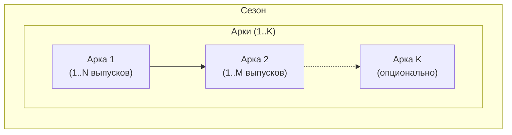

# 🏛️ Сценарий выпусков [НОМЕРА] — [НАЗВАНИЕ СЕЗОНА]

**Период:** [Даты AUC / до н.э.]  
**Эпоха:** [Краткое описание исторического контекста]  

> **Примечание:** В одном сезоне можно совмещать несколько арок, если это художественно оправдано. Это позволяет создавать плавные переходы между эпохами без искусственного разрыва повествования

---

## 📋 Обзор сезона

| Параметр | Значение |
|----------|----------|
| Количество выпусков | [4–5] |
| Ключевое событие(я) | [Главное историческое событие(я)] |
| Основные персонажи | [Имена и роли] |
| География | [Рим, окрестности, внешние угрозы] |
| Связь с предыдущим сезоном | [Кратко] |

---

## 🎯 Задачи сезона

1. **Исторические:** [Какие события отразить]
2. **Нарративные:** [Какие эмоции/темы передать]
3. **Стилистические:** [Особые требования к тону, формату]

---

## 📰 Сценарий выпусков

### Выпуск [N] — [Название этапа]

**Задачи выпуска:**
Заполняются на этапе разработки сценария

**Использованные в выпуске мотивы:**
Заполняются уже по итогу выпуска, чтобы избегать ненужных повторов в будущем

---

## 🔗 Блок-схема сезона

---

## 📝 Ключевые характеристики персонажей

---

## Рецензия историка

### Рекомендуемые источники

### Рекомендации по усилению историчности

---

## ⚠️ Чек-лист анахронизмов

| Ошибка | Корректная замена |
|--------|-------------------|

---

## Правила историчности для иллюстраций

Здесь описываем ключевые элементы для иллюстрации эпохи сценария, желательно на английском:

1. ЭПОХА
2. ОДЕЖДА
3. АРХИТЕКТУРА
4. МАТЕРИАЛЫ

Пояснение. Зачем мы вводим жесткие правила историчности для иллюстраций:

1. Борьба с «киношными» стереотипами
ИИ обучен на «голливудских» версиях истории. Мы принудительно «отключаем» эти клише
2. Защита от «галлюцинаций» нейросети
ИИ «додумывает» детали, основываясь на запросах «Рим». Если не задать жесткие `[NEGATIVE]`-рамки, модель выдаст имперский глянец, который может не соответствовать эпохе
3. Интеграция визуала в текст
Мы гарантируем, что картинка не противоречит статье. Если мы пишем о суровости быта консулов, иллюстрация обязана транслировать ту же простоту и скудность ресурсов, а не величие будущего ампира

**Простыми словами:** Правила — это «фильтр реальности», который заставляет нейросеть рисовать не то, что она «думает» о Риме, а то, чем он был на самом деле в конкретный момент времени

---

## 🎨 Технические рекомендации для генерации

Для заметок по ходу генераций текущих изображений для улучшения промптов будущих выпусков