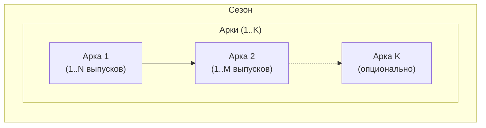

# 🏛️ Сценарий выпусков [НОМЕРА] — [НАЗВАНИЕ СЕЗОНА]

**Период:** [Даты AUC / до н.э.]  
**Эпоха:** [Краткое описание исторического контекста]  

> **Примечание:** В одном сезоне можно совмещать несколько арок, если это художественно оправдано. Это позволяет создавать плавные переходы между эпохами без искусственного разрыва повествования

---

## 📋 Обзор сезона

| Параметр | Значение |
|----------|----------|
| Количество выпусков | [4–5] |
| Ключевое событие(я) | [Главное историческое событие(я)] |
| Основные персонажи | [Имена и роли] |
| География | [Рим, окрестности, внешние угрозы] |
| Связь с предыдущим сезоном | [Кратко] |

---

## 🎯 Задачи сезона

1. **Исторические:** [Какие события отразить]
2. **Нарративные:** [Какие эмоции/темы передать]
3. **Стилистические:** [Особые требования к тону, формату]

---

## 📰 Сценарий выпусков

### Выпуск [N] — [Название этапа]

**Задачи выпуска:**

---

## 🔗 Блок-схема сезона

---

## 📝 Ключевые характеристики персонажей

---

## Рецензия историка

### Рекомендуемые источники

### Рекомендации по усилению историчности

---

## ⚠️ Чек-лист анахронизмов

| Ошибка | Корректная замена |
|--------|-------------------|